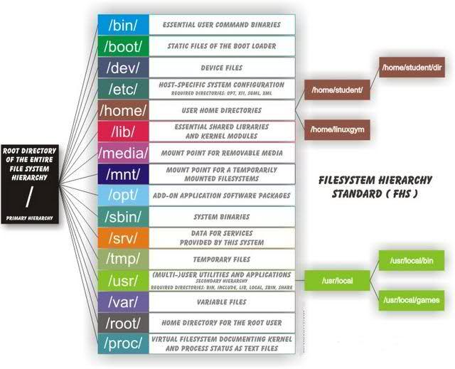

* /     虚拟目录的根目录。通常不会在这里存储文件
* /bin  二进制目录，存放许多用户级的GNU工具
* /boot 启动目录，存放启动文件
* /dev  设备目录，Linux在这里创建设备节点
* /etc  系统配置文件目录
* /home 主目录，Linux在这里创建用户目录
* /lib  库目录，存放系统和应用程序的库文件
* /media媒体目录，可移动媒体设备的常用挂载点
* /mnt  挂载目录，另一个可移动媒体设备的常用挂载点
* /opt  可选目录，常用于存放第三方软件包和数据文件
* /proc 进程目录，存放现有硬件及当前进程的相关信息
* /root root用户的主目录
* /sbin 系统二进制目录，存放许多GNU管理员级工具
* /run  运行目录，存放系统运作时的运行时数据
* /srv  服务目录，存放本地服务的相关文件
* /sys  系统目录，存放系统硬件信息的相关文件
* /tmp  临时目录，可以在该目录中创建和删除临时工作文件
* /usr  用户二进制目录，大量用户级的GNU工具和数据文件都存储在这里
* /var  可变目录，用以存放经常变化的文件，比如日志文件

https://www.tecmint.com/linux-directory-structure-and-important-files-paths-explained/

* rmdir 删除空目录
* rm 删除文件或者目录，用法 rm rf test.txt ( -r 表示递归， -f 表示强制 。
* cp拷贝文件，用法: cp old.txt /tmp/new.txt ，常用来备份；如果拷贝目录需要加-r 参数。
* Useradd创建用户，用法 useradd aaa, userdel aaa。
* Groupadd创建组，用法 groupadd bbb, groupdel bbb。
* vi修改某个文件， vi 有三种模式：命令行模式、文本输入模式、末行模式。
 ** 默认vi 打开一个文件，首先是命令行模式，然后按 i 进入文本输入模式，可
以在文件里写入字符等等信息。
 ** 写完后，按esc 进入命令模式，
 ** 然后输入: 进入末行模式，例如输入 :wq 表示
保存退出。如果想直接退出，不保存，可以执行 :q! 叹号表示强制退出。

* cat test.txt |more 分页显示text内容
* echo回显，用法 echo ok ，会显示 ok ，输入什么就打印什么。
    ** echo ok > test.txt；把ok字符覆盖test.txt内容
    ** >>两个大于符号，表示追加,echo ok >> test.txt,表示向表示向test.txt文件追加OK字符，不覆盖原文件里的内容
    
    
在系统中，通过 UID来区分用户的权限级别， UID 等于 0 表示此用户具有最高权限，也就是管理员。其他的用户 UID 依次增加，通过 /etc/passwd 用户密码文件可以查看到每个用户的独立的 UID 。每一个文件或者目录的权限，都包含一个用户权限、一个组的权限、其他人权限。

* -rw-r--r--  1 root root     6451 Oct 16  2018 add_server.sh   第一个root 表示该文件所有者是 root 用户，第二个 root 代表该文件的所属的组为 root 组，其他用户这里默认不标出。

* 如果我们想改变某个文件的所有者或者所属的组，可以使用命令chown 即：chown -R test:test aaa.sh 。

* 每个Linux 文件具有四种访问权限：可读(r)、可写(w) 、可执行(x)和无权限(-) 。利用 ls -l 命令可以看到某个文件或目录的权限，它以显示数据的第一个字段为准。第一个字段由10个字符组成：
    ** 第一位表示文件类型，-表示文件， d表示目录；后面每三位为一组。
    ** 第一组： 2-4 位表示文件所有者的权限，即用户 user 权限，简称 u
    ** 第二组： 5-7 位表示文件所有者所属组成员的权限， group 权限，简称 g
    ** 第三组： 8-10 位表示所有者所属组之外的用户的权限， other 权限，简称 o

为了能更简单快捷的使用和熟悉权限， rwx 权限可以用数字来表示，分别表
示为 r(4) w(2) x(1)。如果给某个文件授权，命令为
chmod 777 aaa.sh

* Linux 服务器默认网卡配置文件在/etc/sysconfig/network scripts/ 下，命名的名称一般为 ifcfg-eth0 ifcfg-eth1,eth0表示第一块网卡，eth1 表示第二块网卡，依次类推。
    ** 重启网卡: /etc/init.d/network restart
    ** DNS配置：/etc/resolv.conf 从上到下，分别表示主DNS ，备 DNS
    
* SHELL常见的系统变量解析
    ** $0 当前程序的名称
    ** $n 当前程序的第n个参数
    ** $* 当前程序的所有参数当前程序的所有参数(不包括程序本身不包括程序本身)
    ** $# 当前程序的参数个数当前程序的参数个数(不包括程序本身不包括程序本身)
    ** $? 命令或程序执行完后的状态，一般返回命令或程序执行完后的状态，一般返回00表示执行成功。
    ** $UID 当前用户的当前用户的ID
    ** $PWD 当前所在的目录