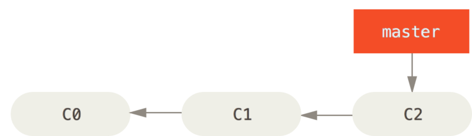

 Git 有三种状态，你的文件可能处于其中之一：已提交（committed）、已修改（modified）和已暂存（staged）。 已提交表示数据已经安全的保存在本地数据库中。 已修改表示修改了文件，但还没保存到数据库中。 已暂存表示对一个已修改文件的当前版本做了标记，使之包含在下次提交的快照中。
 由此引入 Git 项目的三个工作区域的概念：Git 仓库、工作目录以及暂存区域。
 
image::images/gitnotes/areas.png[]

Git 仓库目录是 Git 用来保存项目的元数据和对象数据库的地方。 这是 Git 中最重要的部分，从其它计算机克隆仓库时，拷贝的就是这里的数据。

工作目录是对项目的某个版本独立提取出来的内容。 这些从 Git 仓库的压缩数据库中提取出来的文件，放在磁盘上供你使用或修改。

暂存区域是一个文件，保存了下次将提交的文件列表信息，一般在 Git 仓库目录中。 有时候也被称作“索引”，不过一般说法还是叫暂存区域。

基本的 Git 工作流程如下：

    在工作目录中修改文件。
    暂存文件，将文件的快照放入暂存区域。
    提交更新，找到暂存区域的文件，将快照永久性存储到 Git 仓库目录。
    
如果 Git 目录中保存着特定版本的文件，就属于已提交状态。 如果作了修改并已放入暂存区域，就属于已暂存状态。 如果自上次取出后，作了修改但还没有放到暂存区域，就是已修改状态。 

安装参考 https://git-scm.com/book/zh/v2/%E8%B5%B7%E6%AD%A5-%E5%AE%89%E8%A3%85-Git[链接]

Git 自带一个 git config 的工具来帮助设置控制 Git 外观和行为的配置变量。 这些变量存储在三个不同的位置：

    * /etc/gitconfig 文件: 包含系统上每一个用户及他们仓库的通用配置。 如果在执行 git config 时带上 --system 选项，那么它就会读写该文件中的配置变量。 （由于它是系统配置文件，因此你需要管理员或超级用户权限来修改它。）

    * ~/.gitconfig 或 ~/.config/git/config 文件：只针对当前用户。 你可以传递 --global 选项让 Git 读写此文件，这会对你系统上 所有 的仓库生效。

    * 当前使用仓库的 Git 目录中的 config 文件（即 .git/config）：针对该仓库。 你可以传递 --local 选项让 Git 强制读写此文件，虽然默认情况下用的就是它。。 （当然，你需要进入某个 Git 仓库中才能让该选项生效。）

每一个级别会覆盖上一级别的配置，所以 .git/config 的配置变量会覆盖 /etc/gitconfig 中的配置变量。

可以通过以下命令查看所有的配置以及它们所在的文件：

    $ git config --list --show-origin

用户信息配置

    $ git config --global user.name "your name"
    $ git config --global user.email youremail@example.com

文本编辑器配置
    
    $ git config --global core.editor emacs

https://git-scm.com/book/zh/v2/%E9%99%84%E5%BD%95-C%3A-Git-%E5%91%BD%E4%BB%A4-%E8%AE%BE%E7%BD%AE%E4%B8%8E%E9%85%8D%E7%BD%AE#_core_editor[编辑器信息具体参考]    

检查配置信息
    
    $ git config --list
    
可以通过输入 git config <key>： 来检查 Git 的某一项配置

    $ git config user.name

由于 Git 会从多个文件中读取同一配置变量的不同值，因此你可能会在其中看到意料之外的值而不知道为什么。 此时，你可以查询 Git 中该变量的 原始 值，它会告诉你哪一个配置文件最后设置了该值：

    $ git config --show-origin rerere.autoUpdate
    file:/home/johndoe/.gitconfig	false
    
若你使用 Git 时需要获取帮助，有三种等价的方法可以找到 Git 命令的综合手册（manpage）：

    $ git help <verb>
    $ git <verb> --help 
    $ man git-<verb>
    
例如，要想获得 git config 命令的手册，执行

    $ git help config

在已存在目录中初始化仓库

    $ cd /home/user/my_project
    $ git init

克隆现有的仓库

    $ git clone https://github.com/libgit2/libgit2
    
工作目录下的每一个文件都不外乎这两种状态：已跟踪 或 未跟踪。 已跟踪的文件是指那些被纳入了版本控制的文件，在上一次快照中有它们的记录，在工作一段时间后， 它们的状态可能是未修改，已修改或已放入暂存区。简而言之，已跟踪的文件就是 Git 已经知道的文件。

工作目录中除已跟踪文件外的其它所有文件都属于未跟踪文件，它们既不存在于上次快照的记录中，也没有被放入暂存区。 初次克隆某个仓库的时候，工作目录中的所有文件都属于已跟踪文件，并处于未修改状态，因为 Git 刚刚检出了它们， 而你尚未编辑过它们。

编辑过某些文件之后，由于自上次提交后你对它们做了修改，Git 将它们标记为已修改文件。 在工作时，你可以选择性地将这些修改过的文件放入暂存区，然后提交所有已暂存的修改，如此反复。

image::images/gitnotes/lifecycle.png[生命周期]

检查当前文件状态

    $ git status
    On branch master
    Your branch is up-to-date with 'origin/master'.
    nothing to commit, working directory clean

现在的工作目录相当干净。换句话说，所有已跟踪文件在上次提交后都未被更改过。 此外，上面的信息还表明，当前目录下没有出现任何处于未跟踪状态的新文件，否则 Git 会在这里列出来。 最后，该命令还显示了当前所在分支，并告诉你这个分支同远程服务器上对应的分支没有偏离。 现在，分支名是“master”,这是默认的分支名。

在项目下创建一个新的 README 文件。 如果之前并不存在这个文件，使用 git status 命令，你将看到一个新的未跟踪文件：
    
    $ echo 'My Project' > README
    $ git status
    On branch master
    Your branch is up-to-date with 'origin/master'.
    Untracked files:
      (use "git add <file>..." to include in what will be committed)
        README
    nothing added to commit but untracked files present (use "git add" to track)

在状态报告中可以看到新建的 README 文件出现在 Untracked files 下面。 未跟踪的文件意味着 Git 在之前的快照（提交）中没有这些文件；Git 不会自动将之纳入跟踪范围，除非你明明白白地告诉它“我需要跟踪该文件”。

使用命令 git add 开始跟踪一个文件。 所以，要跟踪 README 文件，运行：

    $ git add README
    
此时再运行 git status 命令，会看到 README 文件已被跟踪，并处于暂存状态：

    $ git status
    On branch master
    Your branch is up-to-date with 'origin/master'.
    Changes to be committed:
      (use "git restore --staged <file>..." to unstage)
        new file:   README
        
只要在 Changes to be committed 这行下面的，就说明是已暂存状态。 

现在我们来修改一个已被跟踪的文件。 如果你修改了一个名为 CONTRIBUTING.md 的已被跟踪的文件，然后运行 git status 命令，会看到下面内容：

    $ git status
    On branch master
    Your branch is up-to-date with 'origin/master'.
    Changes to be committed:
      (use "git reset HEAD <file>..." to unstage)
        new file:   README
    Changes not staged for commit:
      (use "git add <file>..." to update what will be committed)
      (use "git checkout -- <file>..." to discard changes in working directory)
        modified:   CONTRIBUTING.md
        
文件 CONTRIBUTING.md 出现在 Changes not staged for commit 这行下面，说明已跟踪文件的内容发生了变化，但还没有放到暂存区。 要暂存这次更新，需要运行 git add 命令。 这是个多功能命令：可以用它开始跟踪新文件，或者把已跟踪的文件放到暂存区，还能用于合并时把有冲突的文件标记为已解决状态等。 将这个命令理解为“精确地将内容添加到下一次提交中”而不是“将一个文件添加到项目中”要更加合适。 现在让我们运行 git add 将“CONTRIBUTING.md”放到暂存区，然后再看看 git status 的输出：
    
    $ git add CONTRIBUTING.md
    $ git status
    On branch master
    Your branch is up-to-date with 'origin/master'.
    Changes to be committed:
      (use "git reset HEAD <file>..." to unstage)
        new file:   README
        modified:   CONTRIBUTING.md

现在两个文件都已暂存，下次提交时就会一并记录到仓库。 假设此时，你想要在 CONTRIBUTING.md 里再加条注释。 重新编辑存盘后，准备好提交。 不过且慢，再运行 git status 看看：

    $ vim CONTRIBUTING.md
    $ git status
    On branch master
    Your branch is up-to-date with 'origin/master'.
    Changes to be committed:
      (use "git reset HEAD <file>..." to unstage)
        new file:   README
        modified:   CONTRIBUTING.md
    Changes not staged for commit:
      (use "git add <file>..." to update what will be committed)
      (use "git checkout -- <file>..." to discard changes in working directory)
        modified:   CONTRIBUTING.md
        
怎么回事？ 现在 CONTRIBUTING.md 文件同时出现在暂存区和非暂存区。 这怎么可能呢？ 好吧，实际上 Git 只不过暂存了你运行 git add 命令时的版本。 如果你现在提交，CONTRIBUTING.md 的版本是你最后一次运行 git add 命令时的那个版本，而不是你运行 git commit 时，在工作目录中的当前版本。 所以，运行了 git add 之后又作了修订的文件，需要重新运行 git add 把最新版本重新暂存起来：

    $ git add CONTRIBUTING.md
    $ git status
    On branch master
    Your branch is up-to-date with 'origin/master'.
    Changes to be committed:
      (use "git reset HEAD <file>..." to unstage)
        new file:   README
        modified:   CONTRIBUTING.md

==== 状态简览

使用 git status -s 命令或 git status --short 命令，你将得到一种格式更为紧凑的输出。

    $ git status -s
     M README
    MM Rakefile
    A  lib/git.rb
    M  lib/simplegit.rb
    ?? LICENSE.txt
    
新添加的未跟踪文件前面有 ?? 标记，新添加到暂存区中的文件前面有 A 标记，修改过的文件前面有 M 标记。 输出中有两栏，左栏指明了暂存区的状态，右栏指明了工作区的状态。例如，上面的状态报告显示： README 文件在工作区已修改但尚未暂存，而 lib/simplegit.rb 文件已修改且已暂存。 Rakefile 文件已修，暂存后又作了修改，因此该文件的修改中既有已暂存的部分，又有未暂存的部分。

==== 忽略文件，可以创建一个名为 .gitignore 的文件，列出要忽略的文件的模式。

文件 .gitignore 的格式规范如下：

    所有空行或者以 # 开头的行都会被 Git 忽略。
    可以使用标准的 glob 模式匹配，它会递归地应用在整个工作区中
    匹配模式可以以（/）开头防止递归。
    匹配模式可以以（/）结尾指定目录。
    要忽略指定模式以外的文件或目录，可以在模式前加上叹号（!）取反。

    `所谓的 glob 模式是指 shell 所使用的简化了的正则表达式。 星号（*）匹配零个或多个任意字符；[abc] 匹配任何一个列在方括号中的字符 （这个例子要么匹配一个 a，要么匹配一个 b，要么匹配一个 c）； 问号（?）只匹配一个任意字符；如果在方括号中使用短划线分隔两个字符， 表示所有在这两个字符范围内的都可以匹配（比如 [0-9] 表示匹配所有 0 到 9 的数字）。 使用两个星号（**）表示匹配任意中间目录，比如 a/**/z 可以匹配 a/z 、 a/b/z 或 a/b/c/z 等。`

再看一个 .gitignore 文件的例子：
    
    # 忽略所有的 .a 文件
    *.a
    
    # 但跟踪所有的 lib.a，即便你在前面忽略了 .a 文件
    !lib.a
    
    # 只忽略当前目录下的 TODO 文件，而不忽略 subdir/TODO
    /TODO
    
    # 忽略任何目录下名为 build 的文件夹
    build/
    
    # 忽略 doc/notes.txt，但不忽略 doc/server/arch.txt
    doc/*.txt
    
    # 忽略 doc/ 目录及其所有子目录下的 .pdf 文件
    doc/**/*.pdf

GitHub 有一个十分详细的针对数十种项目及语言的 .gitignore 文件列表， 你可以在  https://github.com/github/gitignore 找到它。

查看尚未暂存的文件更新了哪些部分，不加参数直接输入 git diff：

    $ git diff
    
此命令比较的是工作目录中当前文件和暂存区域快照之间的差异。 也就是修改之后还没有暂存起来的变化内容。

若要查看已暂存的将要添加到下次提交里的内容，可以用 git diff --staged 命令。 这条命令将比对已暂存文件与最后一次提交的文件差异：

    $ git diff --staged

==== 提交更新

现在的暂存区已经准备就绪，可以提交了。 在此之前，请务必确认还有什么已修改或新建的文件还没有 git add 过， 否则提交的时候不会记录这些尚未暂存的变化。 这些已修改但未暂存的文件只会保留在本地磁盘。 所以，每次准备提交前，先用 git status 看下，你所需要的文件是不是都已暂存起来了， 然后再运行提交命令 git commit：

    $ git commit

这样会启动你选择的文本编辑器来输入提交说明。也可以在 commit 命令后添加 -m 选项，将提交信息与命令放在同一行，如下所示：

    $ git commit -m "Story 182: Fix benchmarks for speed"

Git 提供了一个跳过使用暂存区域的方式， 只要在提交的时候，给 git commit 加上 -a 选项，Git 就会自动把所有已经跟踪过的文件暂存起来一并提交，从而跳过 git add 步骤：

    $ git status
    On branch master
    Your branch is up-to-date with 'origin/master'.
    Changes not staged for commit:
      (use "git add <file>..." to update what will be committed)
      (use "git checkout -- <file>..." to discard changes in working directory)
        modified:   CONTRIBUTING.md
    no changes added to commit (use "git add" and/or "git commit -a")
    $ git commit -a -m 'added new benchmarks'
    [master 83e38c7] added new benchmarks
     1 file changed, 5 insertions(+), 0 deletions(-)

提交之前不再需要 git add 文件“CONTRIBUTING.md”了。 这是因为 -a 选项使本次提交包含了所有修改过的文件。 这很方便，但是要小心，有时这个选项会将不需要的文件添加到提交中。

==== 移除文件

要从 Git 中移除某个文件，就必须要从已跟踪文件清单中移除（确切地说，是从暂存区域移除），然后提交。 可以用 git rm 命令完成此项工作，并连带从工作目录中删除指定的文件，这样以后就不会出现在未跟踪文件清单中了。

如果只是简单地从工作目录中手工删除文件，运行 git status 时就会在 “Changes not staged for commit” 部分（也就是 未暂存清单）看到：

    $ rm PROJECTS.md
    $ git status
    On branch master
    Your branch is up-to-date with 'origin/master'.
    Changes not staged for commit:
      (use "git add/rm <file>..." to update what will be committed)
      (use "git checkout -- <file>..." to discard changes in working directory)
            deleted:    PROJECTS.md
    no changes added to commit (use "git add" and/or "git commit -a")

然后再运行 git rm 记录此次移除文件的操作：
    
    $ git rm PROJECTS.md
    rm 'PROJECTS.md'
    $ git status
    On branch master
    Your branch is up-to-date with 'origin/master'.
    Changes to be committed:
      (use "git reset HEAD <file>..." to unstage)
        deleted:    PROJECTS.md
        
下一次提交时，该文件就不再纳入版本管理了。 如果要删除之前修改过或已经放到暂存区的文件，则必须使用强制删除选项 -f（译注：即 force 的首字母）。 这是一种安全特性，用于防止误删尚未添加到快照的数据，这样的数据不能被 Git 恢复。

另外一种情况是，我们想把文件从 Git 仓库中删除（亦即从暂存区域移除），但仍然希望保留在当前工作目录中。 换句话说，你想让文件保留在磁盘，但是并不想让 Git 继续跟踪。 当你忘记添加 .gitignore 文件，不小心把一个很大的日志文件或一堆 .a 这样的编译生成文件添加到暂存区时，这一做法尤其有用。 为达到这一目的，使用 --cached 选项：

    $ git rm --cached README
    
git rm 命令后面可以列出文件或者目录的名字，也可以使用 glob 模式。比如：

    $ git rm log/\*.log
    
注意到星号 * 之前的反斜杠 \， 因为 Git 有它自己的文件模式扩展匹配方式，所以我们不用 shell 来帮忙展开。 此命令删除 log/ 目录下扩展名为 .log 的所有文件。 类似的比如：

    $ git rm \*~

该命令会删除所有名字以 ~ 结尾的文件。

==== 移动文件

要在 Git 中对文件改名，可以这么做：

    $ git mv file_from file_to

    $ git mv README.md README
    $ git status
    On branch master
    Your branch is up-to-date with 'origin/master'.
    Changes to be committed:
      (use "git reset HEAD <file>..." to unstage)
        renamed:    README.md -> README
        
其实，运行 git mv 就相当于运行了下面三条命令：

    $ mv README.md README
    $ git rm README.md
    $ git add README
    
==== 查看提交历史

    $ git log
    
不传入任何参数的默认情况下，git log 会按时间先后顺序列出所有的提交，最近的更新排在最上面。这个命令会列出每个提交的 SHA-1 校验和、作者的名字和电子邮件地址、提交时间以及提交说明。

几个最常用的选项

1. -p 或 --patch ，它会显示每次提交所引入的差异（按 补丁 的格式输出）。 你也可以限制显示的日志条目数量，例如使用 -2 选项来只显示最近的两次提交：

    $ git log -p -2
    
该选项除了显示基本信息之外，还附带了每次提交的变化。 当进行代码审查，或者快速浏览某个搭档的提交所带来的变化的时候，这个参数就非常有用了。 

2. 想看到每次提交的简略统计信息，可以使用 --stat 选项：

    $ git log --stat
    
3.  --pretty。 这个选项可以使用不同于默认格式的方式展示提交历史。 这个选项有一些内建的子选项供你使用。 比如 oneline 会将每个提交放在一行显示，在浏览大量的提交时非常有用。 另外还有 short，full 和 fuller 选项，它们展示信息的格式基本一致，但是详尽程度不一：

    $ git log --pretty=oneline
    ca82a6dff817ec66f44342007202690a93763949 changed the version number
    085bb3bcb608e1e8451d4b2432f8ecbe6306e7e7 removed unnecessary test
    a11bef06a3f659402fe7563abf99ad00de2209e6 first commit
    
    format ，可以定制记录的显示格式。
    $ git log --pretty=format:"%h - %an, %ar : %s"
    ca82a6d - Scott Chacon, 6 years ago : changed the version number
    085bb3b - Scott Chacon, 6 years ago : removed unnecessary test
    a11bef0 - Scott Chacon, 6 years ago : first commit

4. 当 oneline 或 format 与另一个 log 选项 --graph 结合使用时尤其有用。 这个选项添加了一些 ASCII 字符串来形象地展示你的分支、合并历史：
    
    $ git log --pretty=format:"%h %s" --graph
    * 2d3acf9 ignore errors from SIGCHLD on trap
    *  5e3ee11 Merge branch 'master' of git://github.com/dustin/grit
    |\
    | * 420eac9 Added a method for getting the current branch.
    * | 30e367c timeout code and tests
    * | 5a09431 add timeout protection to grit
    * | e1193f8 support for heads with slashes in them
    |/
    * d6016bc require time for xmlschema
    *  11d191e Merge branch 'defunkt' into local

git log 的常用选项

|===

| 选项	| 说明
| -p | 按补丁格式显示每个提交引入的差异。
| --stat | 显示每次提交的文件修改统计信息。
| --shortstat | 只显示 --stat 中最后的行数修改添加移除统计。
| --name-only | 仅在提交信息后显示已修改的文件清单。
| --name-status | 
显示新增、修改、删除的文件清单。
| --abbrev-commit | 仅显示 SHA-1 校验和所有 40 个字符中的前几个字符。
| --relative-date | 使用较短的相对时间而不是完整格式显示日期（比如“2 weeks ago”）。
| --graph | 在日志旁以 ASCII 图形显示分支与合并历史。
| --pretty | 使用其他格式显示历史提交信息。可用的选项包括 oneline、short、full、fuller 和 format（用来定义自己的格式）。
|--oneline | --pretty=oneline --abbrev-commit 合用的简写。
|===

==== 撤消操作
有时候我们提交完了才发现漏掉了几个文件没有添加，或者提交信息写错了。 此时，可以运行带有 --amend 选项的提交命令来重新提交：

    $ git commit --amend
    
这个命令会将暂存区中的文件提交。 如果自上次提交以来你还未做任何修改（例如，在上次提交后马上执行了此命令）， 那么快照会保持不变，而你所修改的只是提交信息。

文本编辑器启动后，可以看到之前的提交信息。 编辑后保存会覆盖原来的提交信息。

例如，你提交后发现忘记了暂存某些需要的修改，可以像下面这样操作：

    $ git commit -m 'initial commit'
    $ git add forgotten_file
    $ git commit --amend

最终你只会有一个提交——第二次提交将代替第一次提交的结果。

==== 取消暂存的文件
你已经修改了两个文件并且想要将它们作为两次独立的修改提交， 但是却意外地输入 git add * 暂存了它们两个。如何只取消暂存两个中的一个呢？ git status 命令提示了你：

    $ git add *
    $ git status
    On branch master
    Changes to be committed:
      (use "git reset HEAD <file>..." to unstage)
        renamed:    README.md -> README
        modified:   CONTRIBUTING.md
        
在 “Changes to be committed” 文字正下方，提示使用 git reset HEAD <file>... 来取消暂存。 所以，我们可以这样来取消暂存 CONTRIBUTING.md 文件：

    $ git reset HEAD CONTRIBUTING.md
    Unstaged changes after reset:
    M	CONTRIBUTING.md
    $ git status
    On branch master
    Changes to be committed:
      (use "git reset HEAD <file>..." to unstage)
        renamed:    README.md -> README
    Changes not staged for commit:
      (use "git add <file>..." to update what will be committed)
      (use "git checkout -- <file>..." to discard changes in working directory)
        modified:   CONTRIBUTING.md
        
CONTRIBUTING.md 文件已经是修改未暂存的状态了。

==== 撤消对文件的修改
如果你并不想保留对 CONTRIBUTING.md 文件的修改怎么办？ 你该如何方便地撤消修改——将它还原成上次提交时的样子（或者刚克隆完的样子，或者刚把它放入工作目录时的样子）？

    $ git checkout -- CONTRIBUTING.md
    $ git status
    On branch master
    Changes to be committed:
      (use "git reset HEAD <file>..." to unstage)
        renamed:    README.md -> README

可以看到那些修改已经被撤消了。请务必记得 git checkout -- <file> 是一个危险的命令。 你对那个文件在本地的任何修改都会消失——Git 会用最近提交的版本覆盖掉它。 除非你确实清楚不想要对那个文件的本地修改了，否则请不要使用这个命令。

==== 查看远程仓库

    $ git remote
    $ git remote -v
    
==== 添加远程仓库
 git remote add <shortname> <url> 
 git remote add pb https://github.com/paulboone/ticgit
 现在你可以在命令行中使用字符串 pb 来代替整个 URL。 例如，如果你想拉取 Paul 的仓库中有但你没有的信息，可以运行 git fetch pb：
    $ git fetch pb
    
==== 推送到远程仓库
    git push <remote> <branch>
    
==== 查看某个远程仓库
    git remote show <remote>
    
==== 附注标签
    $ git tag -a v1.4 -m "my version 1.4"

通过使用 git show 命令可以看到标签信息和与之对应的提交信息：

    $ git show v1.4

==== 轻量标签
创建轻量标签，不需要使用 -a、-s 或 -m 选项，只需要提供标签名字：

    $ git tag v1.4-lw
    
==== 删除标签
    git tag -d <tagname>

==== 分支创建
    $ git branch testing

这会在当前所在的提交对象上创建一个指针。

image::images/gitnotes/two-branches.png[]

HEAD 指向当前所在的分支
你可以简单地使用 git log 命令查看各个分支当前所指的对象。 提供这一功能的参数是 --decorate。

    $ git log --oneline --decorate
    f30ab (HEAD -> master, testing) add feature #32 - ability to add new formats to the central interface
    34ac2 Fixed bug #1328 - stack overflow under certain conditions
    98ca9 The initial commit of my project

image:images/gitnotes/head-to-master.png[]

==== 分支切换
    $ git checkout testing
    
image:images/gitnotes/head-to-testing.png[]

==== 项目分叉历史
运行 git log --oneline --decorate --graph --all ，它会输出你的提交历史、各个分支的指向以及项目的分支分叉情况。

    $ git log --oneline --decorate --graph --all
    * c2b9e (HEAD, master) made other changes
    | * 87ab2 (testing) made a change
    |/
    * f30ab add feature #32 - ability to add new formats to the
    * 34ac2 fixed bug #1328 - stack overflow under certain conditions
    * 98ca9 initial commit of my project

image:images/gitnotes/advance-master.png[]

创建新分支的同时切换过去  git checkout -b <newbranchname>

=== 分支合并
新建分支，并提交一些记录

新建一个分支并同时切换到那个分支上，你可以运行一个带有 -b 参数的 git checkout 命令：

    $ git checkout -b iss53

image:images/gitnotes/basic-branching-2.png[]

继续在 #53 问题上工作，并且做了一些提交。 在此过程中，iss53 分支在不断的向前推进，因为你已经检出到该分支 （也就是说，你的 HEAD 指针指向了 iss53 分支）

image:images/gitnotes/basic-branching-3.png[]

有个紧急问题等待你来解决,有了 Git 的帮助，你不必把这个紧急问题和 iss53 的修改混在一起， 你也不需要花大力气来还原关于 53# 问题的修改，然后再添加关于这个紧急问题的修改，最后将这个修改提交到线上分支。 你所要做的仅仅是切换回 master 分支。*但是，在你这么做之前，要留意你的工作目录和暂存区里那些还没有被提交的修改， 它可能会和你即将检出的分支产生冲突从而阻止 Git 切换到该分支。* 最好的方法是，在你切换分支之前，保持好一个干净的状态。

    $ git checkout master
    Switched to branch 'master'

修复这个紧急问题。 我们来建立一个 hotfix 分支，在该分支上工作直到问题解决：
    
    $ git checkout -b hotfix
    Switched to a new branch 'hotfix'
    $ vim index.html
    $ git commit -a -m 'fixed the broken email address'
    [hotfix 1fb7853] fixed the broken email address
     1 file changed, 2 insertions(+)

image:images/gitnotes/basic-branching-4.png[]

运行你的测试，确保你的修改是正确的，然后将 hotfix 分支合并回你的 master 分支来部署到线上。 你可以使用 git merge 命令来达到上述目的：

    $ git checkout master
    $ git merge hotfix
    Updating f42c576..3a0874c
    Fast-forward
     index.html | 2 ++
     1 file changed, 2 insertions(+)
 
在合并的时候，你应该注意到了“快进（fast-forward）”这个词。 由于你想要合并的分支 hotfix 所指向的提交 C4 是你所在的提交 C2 的直接后继， 因此 Git 会直接将指针向前移动。换句话说，当你试图合并两个分支时， 如果顺着一个分支走下去能够到达另一个分支，那么 Git 在合并两者的时候， 只会简单的将指针向前推进（指针右移），因为这种情况下的合并操作没有需要解决的分歧——这就叫做 “快进（fast-forward）”。

image:images/gitnotes/basic-branching-5.png[]

当不需要hotfix分支后，可以使用带 -d 选项的 git branch 命令来删除分支：

    $ git branch -d hotfix

现在你可以切换回你正在工作的分支继续你的工作，也就是针对 #53 问题的那个分支（iss53 分支）。
    
    $ git checkout iss53
    Switched to branch "iss53"
    $ vim index.html
    $ git commit -a -m 'finished the new footer [issue 53]'
    [iss53 ad82d7a] finished the new footer [issue 53]
    1 file changed, 1 insertion(+)

image:images/gitnotes/basic-branching-5.png[]

已经修正了 #53 问题，并且打算将你的工作合并入 master 分支。 为此，你需要合并 iss53 分支到 master 分支，这和之前你合并 hotfix 分支所做的工作差不多。 你只需要检出到你想合并入的分支，然后运行 git merge 命令：

    $ git checkout master
    Switched to branch 'master'
    $ git merge iss53
    Merge made by the 'recursive' strategy.
    index.html |    1 +
    1 file changed, 1 insertion(+)

这和你之前合并 hotfix 分支的时候看起来有一点不一样。 在这种情况下，你的开发历史从一个更早的地方开始分叉开来（diverged）。 因为，master 分支所在提交并不是 iss53 分支所在提交的直接祖先，Git 不得不做一些额外的工作。 出现这种情况的时候，Git 会使用两个分支的末端所指的快照（C4 和 C5）以及这两个分支的工作祖先（C2），做一个简单的三方合并。

image:images/gitnotes/basic-merging-1.png[]

和之前将分支指针向前推进所不同的是，Git 将此次三方合并的结果做了一个新的快照并且自动创建一个新的提交指向它。 这个被称作一次合并提交，它的特别之处在于他有不止一个父提交。

image:images/gitnotes/basic-merging-2.png[]

==== 遇到冲突时的分支合并
    $ git merge iss53
    Auto-merging index.html
    CONFLICT (content): Merge conflict in index.html
    Automatic merge failed; fix conflicts and then commit the result.

此时 Git 做了合并，但是没有自动地创建一个新的合并提交。 Git 会暂停下来，等待你去解决合并产生的冲突。 你可以在合并冲突后的任意时刻使用 git status 命令来查看那些因包含合并冲突而处于未合并（unmerged）状态的文件：
    
    $ git status
    On branch master
    You have unmerged paths.
      (fix conflicts and run "git commit")
    
    Unmerged paths:
      (use "git add <file>..." to mark resolution)
    
        both modified:      index.html
    
    no changes added to commit (use "git add" and/or "git commit -a")
    
任何因包含合并冲突而有待解决的文件，都会以未合并状态标识出来。

使用工具解决冲突 git mergetool

然后git status 可以看到需要再次进行 git commit。分支合并完成。

==== 分支管理
如果不加任何参数运行它，会得到当前所有分支的一个列表：
    
    $ git branch
      iss53
    * master
      testing
      
注意 master 分支前的 * 字符：它代表现在检出的那一个分支（也就是说，当前 HEAD 指针所指向的分支）。 

如果需要查看每一个分支的最后一次提交，可以运行 git branch -v 命令：

    $ git branch -v

--merged 与 --no-merged 这两个有用的选项可以过滤这个列表中已经合并或尚未合并到当前分支的分支。 如果要查看哪些分支已经合并到当前分支，可以运行 git branch --merged：

    $ git branch --merged
      iss53
    * master

上面描述的选项 --merged 和 --no-merged 会在没有给定提交或分支名作为参数时， 分别列出已合并或未合并到 当前 分支的分支。

你总是可以提供一个附加的参数来查看其它分支的合并状态而不必检出它们。 例如，尚未合并到 master 分支的有哪些？
    
    $ git checkout testing
    $ git branch --no-merged master
      topicA
      featureB

==== 远程分支
远程引用是对远程仓库的引用（指针），包括分支、标签等等。 你可以通过 git ls-remote <remote> 来显式地获得远程引用的完整列表， 或者通过 git remote show <remote> 获得远程分支的更多信息。 

==== 变基
提取在 C4 中引入的补丁和修改，然后在 C3 的基础上应用一次。 在 Git 中，这种操作就叫做 变基（rebase）。 你可以使用 rebase 命令将提交到某一分支上的所有修改都移至另一分支上，就好像“重新播放”一样。

image:images/gitnotes/basic-rebase-2.png[]

在这个例子中，你可以检出 experiment 分支，然后将它变基到 master 分支上：
    
    $ git checkout experiment
    $ git rebase master
    First, rewinding head to replay your work on top of it...
    Applying: added staged command

它的原理是首先找到这两个分支（即当前分支 experiment、变基操作的目标基底分支 master） 的最近共同祖先 C2，然后对比当前分支相对于该祖先的历次提交，提取相应的修改并存为临时文件， 然后将当前分支指向目标基底 C3, 最后以此将之前另存为临时文件的修改依序应用。 （译注：写明了 commit id，以便理解，下同）

image:images/gitnotes/basic-rebase-3.png[]

现在回到 master 分支，进行一次快进合并。

    $ git checkout master
    $ git merge experiment

image:images/gitnotes/basic-rebase-4.png[]

更多有趣内容， https://git-scm.com/book/zh/v2/Git-%E5%88%86%E6%94%AF-%E5%8F%98%E5%9F%BA[参考]

*只对尚未推送或分享给别人的本地修改执行变基操作清理历史， 从不对已推送至别处的提交执行变基操作*

==== 在服务器上搭建 Git
为了通过克隆你的仓库来创建一个新的裸仓库，你需要在克隆命令后加上 --bare 选项。 按照惯例，裸仓库的目录名以 .git 结尾，就像这样：

    $ git clone --bare my_project my_project.git
    Cloning into bare repository 'my_project.git'...
    done.

假设一个域名为 git.example.com 的服务器已经架设好，并可以通过 SSH 连接， 你想把所有的 Git 仓库放在 /srv/git 目录下。 假设服务器上存在 /srv/git/ 目录，你可以通过以下命令复制你的裸仓库来创建一个新仓库：
    
    $ scp -r my_project.git user@git.example.com:/srv/git
    
    
此时，其他可通过 SSH 读取此服务器上 /srv/git 目录的用户，可运行以下命令来克隆你的仓库。

    $ git clone user@git.example.com:/srv/git/my_project.git

如果一个用户，通过使用 SSH 连接到一个服务器，并且其对 /srv/git/my_project.git 目录拥有可写权限，那么他将自动拥有推送权限。

如果到该项目目录中运行 git init 命令，并加上 --shared 选项， 那么 Git 会自动修改该仓库目录的组权限为可写。 注意，运行此命令的工程中不会摧毁任何提交、引用等内容。

    $ ssh user@git.example.com
    $ cd /srv/git/my_project.git
    $ git init --bare --shared

===== SSH 连接
如果你有一台所有开发者都可以用 SSH 连接的服务器，架设你的第一个仓库就十分简单了， 因为你几乎什么都不用做（正如我们上一节所说的）。 如果你想在你的仓库上设置更复杂的访问控制权限，只要使用服务器操作系统的普通的文件系统权限就行了。

如果需要团队里的每个人都对仓库有写权限，又不能给每个人在服务器上建立账户，那么提供 SSH 连接就是唯一的选择了。 我们假设用来共享仓库的服务器已经安装了 SSH 服务，而且你通过它访问服务器。

有几个方法可以使你给团队每个成员提供访问权。 第一个就是给团队里的每个人创建账号，这种方法很直接但也很麻烦。 或许你不会想要为每个人运行一次 adduser（或者 useradd）并且设置临时密码。

第二个办法是在主机上建立一个 git 账户，让每个需要写权限的人发送一个 SSH 公钥， 然后将其加入 git 账户的 ~/.ssh/authorized_keys 文件。 这样一来，所有人都将通过 git 账户访问主机。 这一点也不会影响提交的数据——访问主机用的身份不会影响提交对象的提交者信息。

另一个办法是让 SSH 服务器通过某个 LDAP 服务，或者其他已经设定好的集中授权机制，来进行授权。 只要每个用户可以获得主机的 shell 访问权限，任何 SSH 授权机制你都可视为是有效的。

*SSH里面列举的方法，思路很重要，一个简单的git服务器搭建，用到了Linux知识，融会贯通。*

