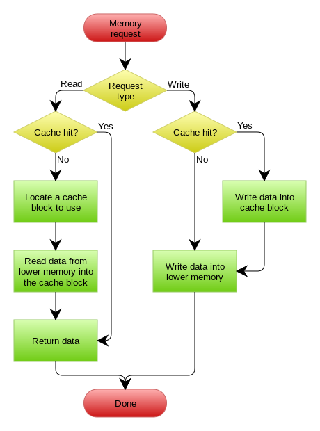

https://coolshell.cn/articles/17416.html[来源coolshell.cn]

更新缓存的的Design Pattern有四种：*Cache aside*, *Read through*, *Write through*, *Write behind caching*，我们下面一一来看一下这四种Pattern。

=== Cache aside
这是最常用最常用的pattern了。其具体逻辑如下：

*失效*：应用程序先从cache取数据，没有得到，则从数据库中取数据，成功后，放到缓存中。

*命中*：应用程序从cache中取数据，取到后返回。

*更新*：先把数据存到数据库中，成功后，再让缓存失效。

image::images/cache/Cache-Aside-Design-Pattern-Flow-Diagram-e1470471723210.png[]
image::images/cache/Updating-Data-using-the-Cache-Aside-Pattern-Flow-Diagram-1-e1470471761402.png[]

注意，我们的更新是先更新数据库，成功后，让缓存失效。一个是查询操作，一个是更新操作的并发，首先，没有了删除cache数据的操作了，而是先更新了数据库中的数据，此时，缓存依然有效，所以，并发的查询操作拿的是没有更新的数据，但是，更新操作马上让缓存的失效了，后续的查询操作再把数据从数据库中拉出来。

这是标准的design pattern，包括Facebook的论文 https://www.usenix.org/system/files/conference/nsdi13/nsdi13-final170_update.pdf[《Scaling Memcache at Facebook》]也使用了这个策略。为什么不是写完数据库后更新缓存？你可以看一下Quora上的这个问答 https://www.quora.com/Why-does-Facebook-use-delete-to-remove-the-key-value-pair-in-Memcached-instead-of-updating-the-Memcached-during-write-request-to-the-backend[《Why does Facebook use delete to remove the key-value pair in Memcached instead of updating the Memcached during write request to the backend?》]，主要是怕两个并发的写操作导致脏数据。

那么，是不是Cache Aside这个就不会有并发问题了？不是的，比如，一个是读操作，但是没有命中缓存，然后就到数据库中取数据，此时来了一个写操作，写完数据库后，让缓存失效，然后，之前的那个读操作再把老的数据放进去，所以，会造成脏数据。这种情况实际上出现的概率可能非常低，因为这个条件需要发生在读缓存时缓存失效，而且并发着有一个写操作。而实际上数据库的写操作会比读操作慢得多，而且还要锁表，而读操作必需在写操作前进入数据库操作，而又要晚于写操作更新缓存，所有的这些条件都具备的概率基本并不大。

=== Read/Write Through Pattern
我们可以看到，在上面的Cache Aside套路中，我们的应用代码需要维护两个数据存储，一个是缓存（Cache），一个是数据库（Repository）。而Read/Write Through套路是把更新数据库（Repository）的操作由缓存来代理，所以，对于应用层来说，就简单很多了。可以理解为，应用认为后端就是一个单一的存储，而存储自己维护自己的Cache。

==== Read Through
Read Through套路就是在查询操作中更新缓存，也就是说，当缓存失效的时候（过期或LRU换出），Cache Aside是由调用方负责把数据加载入缓存，而Read Through则用缓存服务自己来加载，从而对应用方是透明的。

==== Write Through
Write Through 套路和Read Through相仿，不过是在更新数据时发生。当有数据更新的时候，如果没有命中缓存，直接更新数据库，然后返回。如果命中了缓存，则更新缓存，然后再由Cache自己更新数据库（这是一个同步操作）

下图自来Wikipedia的Cache词条。其中的Memory你可以理解为就是我们例子里的数据库。

==== Write Behind Caching Pattern
Write Behind 又叫 Write Back。Write Back是Linux文件系统的Page Cache的算法。

Write Back套路，一句说就是，在更新数据的时候，只更新缓存，不更新数据库，而我们的缓存会异步地批量更新数据库。这个设计的好处就是让数据的I/O操作飞快无比（因为直接操作内存嘛 ），因为异步，write backg还可以合并对同一个数据的多次操作，所以性能的提高是相当可观的。

但是，其带来的问题是，数据不是强一致性的，而且可能会丢失（我们知道Unix/Linux非正常关机会导致数据丢失，就是因为这个事）。在软件设计上，我们基本上不可能做出一个没有缺陷的设计，就像算法设计中的时间换空间，空间换时间一个道理，有时候，强一致性和高性能，高可用和高性性是有冲突的。软件设计从来都是取舍Trade-Off。

另外，Write Back实现逻辑比较复杂，因为他需要track有哪数据是被更新了的，需要刷到持久层上。操作系统的write back会在仅当这个cache需要失效的时候，才会被真正持久起来，比如，内存不够了，或是进程退出了等情况，这又叫lazy write。

在wikipedia上有一张write back的流程图，基本逻辑如下：

image:images/cache/Write-back_with_write-allocation.png[]

上面讲的这些Design Pattern，其实并不是软件架构里的mysql数据库和memcache/redis的更新策略，这些东西都是计算机体系结构里的设计，比如CPU的缓存，硬盘文件系统中的缓存，硬盘上的缓存，数据库中的缓存。基本上来说，这些缓存更新的设计模式都是非常老古董的，而且历经长时间考验的策略。

宏观系统架构中的很多设计都来源于这些微观的东西。比如，云计算中的很多虚拟化技术的原理，和传统的虚拟内存不是很像么？Unix下的那些I/O模型，也放大到了架构里的同步异步的模型，还有Unix发明的管道不就是数据流式计算架构吗？TCP的好些设计也用在不同系统间的通讯中，仔细看看这些微观层面，你会发现有很多设计都非常精妙。

在软件开发或设计中，我非常建议在之前先去参考一下已有的设计和思路，看看相应的guideline，best practice或design pattern，吃透了已有的这些东西，再决定是否要重新发明轮子。千万不要似是而非地，想当然的做软件设计。

上面没有考虑缓存（Cache）和持久层（Repository）的整体事务的问题。比如，更新Cache成功，更新数据库失败了怎么吗？或是反过来。关于这个事，如果你需要强一致性，你需要使用“两阶段提交协议”——prepare, commit/rollback，比如Java 7 的 https://docs.oracle.com/javaee/7/api/javax/transaction/xa/XAResource.html[XAResource]，还有MySQL 5.7的 http://dev.mysql.com/doc/refman/5.7/en/xa.html[XA Transaction]，有些cache也支持XA，比如EhCache。当然，XA这样的强一致性的玩法会导致性能下降，关于分布式的事务的相关话题，你可以看看 https://coolshell.cn/articles/10910.html[《分布式系统的事务处理》]一文。
