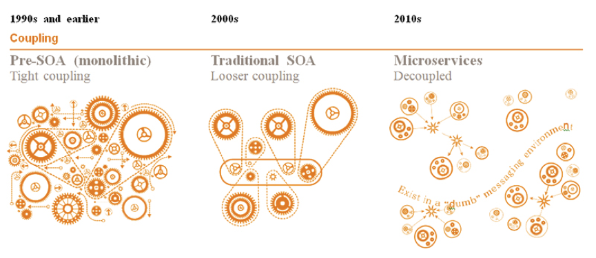
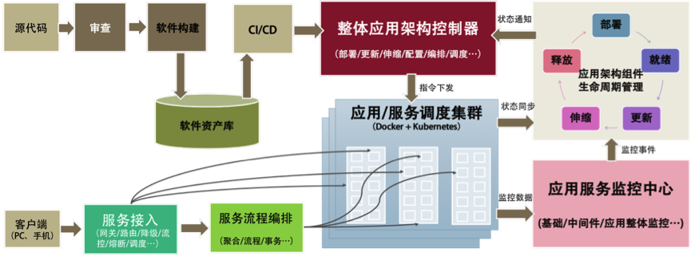

使用分布式系统主要有两方面原因:

* 增大系统容量。我们的业务量越来越大，而要能应对越来越大的业务量，一台机器的性能已经无法满足了，我们需要多台机器才能应对大规模的应用场景。所以，我们需要垂直或是水平拆分业务系统，让其变成一个分布式的架构。
* 加强系统可用。我们的业务越来越关键，需要提高整个系统架构的可用性，这就意味着架构中不能存在单点故障。这样，整个系统不会因为一台机器出故障而导致整体不可用。所以，需要通过分布式架构来冗余系统以消除单点故障，从而提高系统的可用性。

当然，分布式系统还有一些优势，比如：

* 因为模块化，所以系统模块重用度更高；
* 因为软件服务模块被拆分，开发和发布速度可以并行而变得更快；
* 系统扩展性更高；
* 团队协作流程也会得到改善； ……

下面这个表格比较了单体应用和分布式架构的优缺点。

image::images/8fecccec610626a3e348318b1fd17791.png[]

==== 分布式系统的发展
从 20 世纪 70 年代的模块化编程，80 年代的面向事件设计，90 年代的基于接口 / 构件设计，这个世界很自然地演化出了 SOA——基于服务的架构。SOA 架构是构造分布式计算应用程序的方法。它将应用程序功能作为服务发送给最终用户或者其他服务。它采用开放标准与软件资源进行交互，并采用标准的表示方式。

下面是一个 SOA 架构的演化图。



面向服务的架构有以下三个阶段。

* 20 世纪 90 年代前，是单体架构，软件模块高度耦合。当然，这张图同样也说明了有的 SOA 架构其实和单体架构没什么两样，因为都是高度耦合在一起的。就像图中的齿轮一样，当你调用一个服务时，这个服务会调用另一个服务，然后又调用另外的服务……于是整个系统就转起来了。但是这本质是比较耦合的做法。
* 而 2000 年左右出现了比较松耦合的 SOA 架构，这个架构需要一个标准的协议或是中间件来联动其它相关联的服务（如 ESB）。这样一来，服务间并不直接依赖，而是通过中间件的标准协议或是通讯框架相互依赖。这其实就是 IoC（控制反转）和 DIP（依赖倒置原则）设计思想在架构中的实践。它们都依赖于一个标准的协议或是一个标准统一的交互方式，而不是直接调用。
* 而 2010 年后，出现了微服务架构，这个架构更为松耦合。每一个微服务都能独立完整地运行（所谓的自包含），后端单体的数据库也被微服务这样的架构分散到不同的服务中。而它和传统 SOA 的差别在于，服务间的整合需要一个服务编排或是服务整合的引擎。就好像交响乐中需要有一个指挥来把所有乐器编排和组织在一起。

微服务的出现使得开发速度变得更快，部署快，隔离性高，系统的扩展度也很好，但是在集成测试、运维和服务管理等方面就比较麻烦了。所以，需要一套比较好的微服务 PaaS 平台。就像 Spring Cloud 一样需要提供各种配置服务、服务发现、智能路由、控制总线……还有像 Kubernetes 提供的各式各样的部署和调度方式。没有这些 PaaS 层的支撑，微服务也是很难被管理和运维的。

=== 分布式系统中需要注意的问题
==== 问题一：异构系统的不标准问题
这主要表现在：

* 软件和应用不标准。
* 通讯协议不标准。
* 数据格式不标准。
* 开发和运维的过程和方法不标准。

不同的软件，不同的语言会出现不同的兼容性和不同的开发、测试、运维标准。不同的标准会让我们用不同的方式来开发和运维，引起架构复杂度的提升。比如：有的软件修改配置要改它的.conf 文件，而有的则是调用管理 API 接口。在通讯方面，不同的软件用不同的协议，就算是相同的网络协议里也会出现不同的数据格式。还有，不同的团队因为使用不同的技术，也会有不同的开发和运维方式。这些不同的东西，会让我们的整个分布式系统架构变得异常复杂。所以，分布式系统架构需要有相应的规范。

==== 问题二：系统架构中的服务依赖性问题
* 如果非关键业务被关键业务所依赖，会导致非关键业务变成一个关键业务。
* 服务依赖链中，出现“木桶短板效应”——整个 SLA 由最差的那个服务所决定

这是服务治理的内容了。服务治理不但需要我们定义出服务的关键程度，还需要我们定义或是描述出关键业务或服务调用的主要路径。没有这个事情，我们将无法运维或是管理整个系统。

==== 问题三：故障发生的概率更大
* 出现故障不可怕，故障恢复时间过长才可怕。
* 出现故障不可怕，故障影响面过大才可怕。

当机器和服务数量越来越多时，你会发现，人类的缺陷就成为了瓶颈。这个缺陷就是人类无法对复杂的事情做到事无巨细的管理，只有机器自动化才能帮助人类。 也就是，人管代码，代码管机器，人不管机器！

==== 问题四：多层架构的运维复杂度更大
可以把系统分成四层：基础层、平台层、应用层和接入层。

* 基础层就是我们的机器、网络和存储设备等。
* 平台层就是我们的中间件层，Tomcat、MySQL、Redis、Kafka 之类的软件。
* 应用层就是我们的业务软件，比如，各种功能的服务。
* 接入层就是接入用户请求的网关、负载均衡或是 CDN、DNS 这样的东西。

对于这四层，我们需要知道：任何一层的问题都会导致整体的问题；没有统一的视图和管理，导致运维被割裂开来，造成更大的复杂度。

分工不是问题，问题是分工后的协作是否统一和规范。这点，你一定要重视。

构建分布式系统的目的是增加系统容量，提高系统的可用性，转换成技术方面，也就是完成下面两件事。

* 大流量处理。通过集群技术把大规模并发请求的负载分散到不同的机器上。
* 关键业务保护。提高后台服务的可用性，把故障隔离起来阻止多米诺骨牌效应（雪崩效应）。如果流量过大，需要对业务降级，以保护关键业务流转。

说白了就是干两件事。一是提高整体架构的吞吐量，服务更多的并发和流量，二是为了提高系统的稳定性，让系统的可用性更高。

=== 提高架构的性能
提高系统性能的常用技术

image::iamges\a9edeae125a80f381003d8d9d0056317.png[]

* 缓存系统。加入缓存系统，可以有效地提高系统的访问能力。从前端的浏览器，到网络，再到后端的服务，底层的数据库、文件系统、硬盘和 CPU，全都有缓存，这是提高快速访问能力最有效的手段。对于分布式系统下的缓存系统，需要的是一个缓存集群。这其中需要一个 Proxy 来做缓存的分片和路由。
* 负载均衡系统。负载均衡系统是水平扩展的关键技术，它可以使用多台机器来共同分担一部分流量请求。
* 异步调用。异步系统主要通过消息队列来对请求做排队处理，这样可以把前端的请求的峰值给“削平”了，而后端通过自己能够处理的速度来处理请求。这样可以增加系统的吞吐量，但是实时性就差很多了。同时，还会引入消息丢失的问题，所以要对消息做持久化，这会造成“有状态”的结点，从而增加了服务调度的难度。
* 数据分区和数据镜像。数据分区是把数据按一定的方式分成多个区（比如通过地理位置），不同的数据区来分担不同区的流量。这需要一个数据路由的中间件，会导致跨库的 Join 和跨库的事务非常复杂。而数据镜像是把一个数据库镜像成多份一样的数据，这样就不需要数据路由的中间件了。你可以在任意结点上进行读写，内部会自行同步数据。然而，数据镜像中最大的问题就是数据的一致性问题。

对于一般公司来说，在初期，会使用读写分离的数据镜像方式，而后期会采用分库分表的方式。

=== 提高架构的稳定性
提高系统系统稳定性的一些常用技术

image::images\befd21e1b41a257c5028f8c1bc7fa279.png[]

* 服务拆分。服务拆分主要有两个目的：一是为了隔离故障，二是为了重用服务模块。但服务拆分完之后，会引入服务调用间的依赖问题。
* 服务冗余。服务冗余是为了去除单点故障，并可以支持服务的弹性伸缩，以及故障迁移。然而，对于一些有状态的服务来说，冗余这些有状态的服务带来了更高的复杂性。其中一个是弹性伸缩时，需要考虑数据的复制或是重新分片，迁移的时候还要迁移数据到其它机器上。
* 限流降级。当系统实在扛不住压力时，只能通过限流或者功能降级的方式来停掉一部分服务，或是拒绝一部分用户，以确保整个架构不会挂掉。这些技术属于保护措施。
* 高可用架构。通常来说高可用架构是从冗余架构的角度来保障可用性。比如，多租户隔离，灾备多活，或是数据可以在其中复制保持一致性的集群。总之，就是为了不出单点故障。
* 高可用运维。高可用运维指的是 DevOps 中的 CI/CD（持续集成 / 持续部署）。一个良好的运维应该是一条很流畅的软件发布管线，其中做了足够的自动化测试，还可以做相应的灰度发布，以及对线上系统的自动化控制。这样，可以做到“计划内”或是“非计划内”的宕机事件的时长最短。

=== 分布式系统的关键技术
引入分布式系统，会引入一堆技术问题，需要从以下几个方面来解决。

* 服务治理。服务拆分、服务调用、服务发现、服务依赖、服务的关键度定义……服务治理的最大意义是需要把服务间的依赖关系、服务调用链，以及关键的服务给梳理出来，并对这些服务进行性能和可用性方面的管理。
* 架构软件管理。服务之间有依赖，而且有兼容性问题，所以，整体服务所形成的架构需要有架构版本管理、整体架构的生命周期管理，以及对服务的编排、聚合、事务处理等服务调度功能。
* DevOps。分布式系统可以更为快速地更新服务，但是对于服务的测试和部署都会是挑战。所以，还需要 DevOps 的全流程，其中包括环境构建、持续集成、持续部署等。
* 自动化运维。有了 DevOps 后，我们就可以对服务进行自动伸缩、故障迁移、配置管理、状态管理等一系列的自动化运维技术了。
* 资源调度管理。应用层的自动化运维需要基础层的调度支持，也就是云计算 IaaS 层的计算、存储、网络等资源调度、隔离和管理。
* 整体架构监控。如果没有一个好的监控系统，那么自动化运维和资源调度管理只可能成为一个泡影，因为监控系统是你的眼睛。没有眼睛，没有数据，就无法进行高效的运维。所以说，监控是非常重要的部分。这里的监控需要对三层系统（应用层、中间件层、基础层）进行监控。
* 流量控制。最后是我们的流量控制，负载均衡、服务路由、熔断、降级、限流等和流量相关的调度都会在这里，包括灰度发布之类的功能也在这里。

=== 分布式系统的“纲”
分布式系统有五个关键技术，它们是：

* 全栈系统监控；
* 服务/资源调度；
* 流量调度；
* 状态/数据调度；
* 开发和运维的自动化。

而最后一项——开发和运维的自动化，是需要把前四项都做到了，才有可能实现的。所以，最为关键是下面这四项技术，即应用整体监控、资源和服务调度、状态和数据调度及流量调度，它们是构建分布式系统最最核心的东西。

image::images/8958a432f32dd742b6503b60f97cc3f2.png[]

== 全栈系统监控
这个监控系统需要完成的功能为：

* 全栈监控；
* 关联分析；
* 跨系统调用的串联；
* 实时报警和自动处置；
* 系统性能分析。

=== 多层体系的监控
所谓全栈监控，其实就是三层监控。

* 基础层：监控主机和底层资源。比如：CPU、内存、网络吞吐、硬盘 I/O、硬盘使用等。
* 中间层：就是中间件层的监控。比如：Nginx、Redis、ActiveMQ、Kafka、MySQL、Tomcat 等。
* 应用层：监控应用层的使用。比如：HTTP 访问的吞吐量、响应时间、返回码、调用链路分析、性能瓶颈，还包括用户端的监控。

image::images\cf6fe8ee30a3ac3b693d1188b46e4e66.png[]

这还需要一些监控的标准化。

* 日志数据结构化；
* 监控数据格式标准化；
* 统一的监控平台；
* 统一的日志分析。

=== 什么才是好的监控系统
很多监控系统都做得很不好，它们主要有两个很大的问题。

* 监控数据是隔离开来的。因为公司分工的问题，开发、应用运维、系统运维，各管各的，所以很多公司的监控系统之间都有一道墙，完全串不起来。
* 监控的数据项太多。有些公司的运维团队把监控的数据项多做为一个亮点到处讲，比如监控指标达到 5 万多个。老实说，这太丢人了。因为信息太多等于没有信息，抓不住重点的监控才会做成这个样子，完全就是使蛮力的做法。

一个好的监控系统应该有以下几个特征。

* 关注于整体应用的 SLA。主要从为用户服务的 API 来监控整个系统。
* 关联指标聚合。 把有关联的系统及其指标聚合展示。主要是三层系统数据：基础层、平台中间件层和应用层。其中，最重要的是把服务和相关的中间件以及主机关联在一起，服务有可能运行在 Docker 中，也有可能运行在微服务平台上的多个 JVM 中，也有可能运行在 Tomcat 中。总之，无论运行在哪里，我们都需要把服务的具体实例和主机关联在一起，否则，对于一个分布式系统来说，定位问题犹如大海捞针。
* 快速故障定位。 对于现有的系统来说，故障总是会发生的，而且还会频繁发生。故障发生不可怕，可怕的是故障的恢复时间过长。所以，快速地定位故障就相当关键。快速定位问题需要对整个分布式系统做一个用户请求跟踪的 trace 监控，我们需要监控到所有的请求在分布式系统中的调用链，这个事最好是做成没有侵入性的。

换句话说，一个好的监控系统主要是为以下两个场景所设计的。

“体检”

* 容量管理。 提供一个全局的系统运行时数据的展示，可以让工程师团队知道是否需要增加机器或者其它资源。
* 性能管理。可以通过查看大盘，找到系统瓶颈，并有针对性地优化系统和相应代码。

“急诊”

* 定位问题。可以快速地暴露并找到问题的发生点，帮助技术人员诊断问题。
* 性能分析。当出现非预期的流量提升时，可以快速地找到系统的瓶颈，并帮助开发人员深入代码。

只有做到了上述的这些关键点才能是一个好的监控系统。

=== 如何做出一个好的监控系统

* 服务调用链跟踪。这个监控系统应该从对外的 API 开始，然后将后台的实际服务给关联起来，然后再进一步将这个服务的依赖服务关联起来，直到最后一个服务（如 MySQL 或 Redis），这样就可以把整个系统的服务全部都串连起来了。这个事情的最佳实践是 Google Dapper 系统，其对应于开源的实现是 Zipkin。对于 Java 类的服务，我们可以使用字节码技术进行字节码注入，做到代码无侵入式。

image::images\ab79054e0a3cf2d8f1d696e3c367ab81.png[]

* 服务调用时长分布。使用 Zipkin，可以看到一个服务调用链上的时间分布，这样有助于我们知道最耗时的服务是什么。下图是 Zipkin 的服务调用时间分布。

image::images\5fd70b4194854fc8d55c48987cf3644c.png[]

* 服务的 TOP N 视图。所谓 TOP N 视图就是一个系统请求的排名情况。一般来说，这个排名会有三种排名的方法：a）按调用量排名，b) 按请求最耗时排名，c）按热点排名（一个时间段内的请求次数的响应时间和）。

image::images\f4f91d5a3ee95b478c47f62499b0dcf1.png[]

* 数据库操作关联。对于 Java 应用，我们可以很方便地通过 JavaAgent 字节码注入技术拿到 JDBC 执行数据库操作的执行时间。对此，我们可以和相关的请求对应起来。

image::images\29587fed0823f6e8ae7a2d38eaf35af4.png[]

* 服务资源跟踪。我们的服务可能运行在物理机上，也可能运行在虚拟机里，还可能运行在一个 Docker 的容器里，Docker 容器又运行在物理机或是虚拟机上。我们需要把服务运行的机器节点上的数据（如 CPU、MEM、I/O、DISK、NETWORK）关联起来。

一个分布式系统，或是一个自动化运维系统，或是一个 Cloud Native 的云化系统，最重要的事就是把监控系统做好。在把数据收集好的同时，更重要的是把数据关联好。这样，我们才可能很快地定位故障，进而才能进行自动化调度。

== 服务调度
服务治理上的一些关键技术，主要有以下几点。

* 服务关键程度
* 服务依赖关系
* 服务发现
* 整个架构的版本管理
* 服务应用生命周期全管理

=== 服务关键程度和服务的依赖关系
关于服务关键程度，主要是要我们梳理和定义服务的重要程度。这不是使用技术可以完成的，它需要细致地管理对业务的理解，才能定义出架构中各个服务的重要程度。没有依赖，就没有伤害”。这句话的意思就是说，服务间的依赖是一件很易碎的事。依赖越多，依赖越复杂，我们的系统就越易碎。因为依赖关系就像“铁锁连环”一样，一个服务的问题很容易出现一条链上的问题。因此，传统的 SOA 希望通过 ESB 来解决服务间的依赖关系，这也是为什么微服务中希望服务间是没有依赖的，而让上层或是前端业务来整合这些个后台服务。

微服务是服务依赖最优解的上限，而服务依赖的下限是千万不要有依赖环。如果系统架构中有服务依赖环，那么表明你的架构设计是错误的。循环依赖有很多的副作用，最大的问题是这是一种极强的耦合，会导致服务部署相当复杂和难解，而且会导致无穷尽的递归故障和一些你意想不到的问题。解决服务依赖环的方案一般是，依赖倒置的设计模式。在分布式架构上，你可以使用一个第三方的服务来解决这个事。比如，通过订阅或发布消息到一个消息中间件，或是把其中的依赖关系抽到一个第三方的服务中，然后由这个第三方的服务来调用这些原本循环依赖的服务。服务的依赖关系是可以通过技术的手段来发现的，这其中，Zipkin是一个很不错的服务调用跟踪系统，它是通过  https://research.google.com/pubs/pub36356.html[Google  Dapper]这篇论文来实现的。这个工具可以帮你梳理服务的依赖关系，以及了解各个服务的性能。在梳理完服务的重要程度和服务依赖关系之后，我们就相当于知道了整个架构的全局
，再加上相关的监控。

=== 服务状态和生命周期的管理
有了上面这张地图后，我们还需要有一个服务发现的中间件，这个中间件是非常非常关键的。因为这个“架构城市”是非常动态的，有的服务会新加进来，有的会离开，有的会增加更多的实例，有的会减少，有的服务在维护过程中（发布、伸缩等），所以我们需要有一个服务注册中心，来知道这么几个事。

* 整个架构中有多少种服务？
* 这些服务的版本是什么样的？
* 每个服务的实例数有多少个，它们的状态是什么样的?
* 每个服务的状态是什么样的？是在部署中，运行中，故障中，升级中，还是在回滚中，伸缩中，或者是在下线中……

服务的生命周期通常会有以下几个状态：

* Provision，代表在供应一个新的服务；
* Ready，表示启动成功了；
* Run，表示通过了服务健康检查；
* Update，表示在升级中；
* Rollback，表示在回滚中；
* Scale，表示正在伸缩中（可以有 Scale-in 和 Scale-out 两种）；
* Destroy，表示在销毁中；
* Failed，表示失败状态。

这几个状态需要管理好，不然的话，你将不知道这些服务在什么样的状态下。不知道在什么样的状态下，你对整个分布式架构也就无法控制了。

有了这些服务的状态和生命周期的管理，以及服务的重要程度和服务的依赖关系，再加上一个服务运行状态的拟合控制（后面会提到），你一下子就有了管理整个分布式服务的手段了。

=== 整个架构的版本管理
在分布式架构中，我们也需要一个架构的版本，用来控制其中各个服务的版本兼容。比如，A 服务的 1.2 版本只能和 B 服务的 2.2 版本一起工作，A 服务的上个版本 1.1 只能和 B 服务的 2.0 一起工作。这就是版本兼容性。如果架构中有这样的问题，那么我们就需要一个上层架构的版本管理。这样，如果我们要回滚一个服务的版本，就可以把与之有版本依赖的服务也一起回滚掉。当然，一般来说，在设计过程中，我们希望没有版本的依赖性问题。但可能有些时候，我们会有这样的问题，那么就需要在架构版本中记录下这个事，以便可以回滚到上一次相互兼容的版本。要做到这个事，你需要一个架构的 manifest，一个服务清单，这个服务清单定义了所有服务的版本运行环境，其中包括但不限于：

* 服务的软件版本；
* 服务的运行环境——环境变量、CPU、内存、可以运行的结点、文件系统等；
* 服务运行的最大最小实例数。

每一次对这个清单的变更都需要被记录下来，算是一个架构的版本管理。而我们上面所说的那个集群控制系统需要能够解读并执行这个清单中的变更，以操作和管理整个集群中的相关变更。

=== 资源 / 服务调度
服务和资源的调度有点像操作系统。操作系统一方面把用户进程在硬件资源上进行调度，另一方面提供进程间的通信方式，可以让不同的进程在一起协同工作。服务和资源调度的过程，与操作系统调度进程的方式很相似，主要有以下一些关键技术。

* 服务状态的维持和拟合。
* 服务的弹性伸缩和故障迁移。
* 作业和应用调度。
* 作业工作流编排。
* 服务编排。

=== 服务状态的维持和拟合
所谓服务状态不是服务中的数据状态，而是服务的运行状态，换句话说就是服务的 Status，而不是 State。也就是上述服务运行时生命周期中的状态——Provision，Ready，Run，Scale，Rollback，Update，Destroy，Failed……

服务运行时的状态是非常关键的。服务运行过程中，状态也是会有变化的，这样的变化有两种。

* 一种是不预期的变化。比如，服务运行因为故障导致一些服务挂掉，或是别的什么原因出现了服务不健康的状态。而一个好的集群管理控制器应该能够强行维护服务的状态。在健康的实例数变少时，控制器会把不健康的服务给摘除，而又启动几个新的，强行维护健康的服务实例数。
* 另外一种是预期的变化。比如，我们需要发布新版本，需要伸缩，需要回滚。这时，集群管理控制器就应该把集群从现有状态迁移到另一个新的状态。这个过程并不是一蹴而就的，集群控制器需要一步一步地向集群发送若干控制命令。这个过程叫“拟合”——从一个状态拟合到另一个状态，而且要穷尽所有的可能，玩命地不断地拟合，直到达到目的。

对于分布式系统的服务管理来说，当需要把一个状态变成另一个状态时，我们需要对集群进行一系列的操作。比如，当需要对集群进行 Scale 的时候，我们需要：

* 先扩展出几个结点；
* 再往上部署服务；
* 然后启动服务；
* 再检查服务的健康情况；
* 最后把新扩展出来的服务实例加入服务发现中提供服务。

这个操作的过程一定是比较“慢”的。一方面，需要对其它操作排它；另一方面，在整个过程中，我们的控制系统需要努力地逼近最终状态，直到完全达到。此外，正在运行的服务可能也会出现问题，离开了我们想要的状态，而控制系统检测到后，会强行地维持服务的状态。我们把这个过程就叫做“拟合”。基本上来说，集群控制系统都是要干这个事的。没有这种设计的控制系统都不能算做设计精良的控制系统，而且在运行时一定会有很多的坑和 bug。

=== 服务的弹性伸缩和故障迁移
对于弹性伸缩，在上面我已经给出了一个服务伸缩所需要的操作步骤。还是比较复杂的，其中涉及到了：

* 底层资源的伸缩；
* 服务的自动化部署；
* 服务的健康检查；
* 服务发现的注册；
* 服务流量的调度。

而对于故障迁移，也就是服务的某个实例出现问题时，我们需要自动地恢复它。对于服务来说，有两种模式，一种是宠物模式，一种是奶牛模式。

* 所谓宠物模式，就是一定要救活，主要是对于 stateful 的服务。
* 而奶牛模式，就是不救活了，重新生成一个实例。

对于这两种模式，在运行中也是比较复杂的，其中涉及到了：

* 服务的健康监控（这可能需要一个 APM 的监控）。
* 如果是宠物模式，需要：服务的重新启动和服务的监控报警（如果重试恢复不成功，需要人工介入）。
* 如果是奶牛模式，需要：服务的资源申请，服务的自动化部署，服务发现的注册，以及服务的流量调度。

弹性伸缩和故障恢复需要很相似的技术步骤。但是，要完成这些事情并不容易，你需要做很多工作，而且有很多细节上的问题会让你感到焦头烂额。我们非常幸运地生活在了一个比较不错的时代，因为有 Docker 和 Kubernetes 这样的技术，可以非常容易地让我们做这个工作。需要把传统的服务迁移到 Docker 和 Kubernetes 上来，再加上更上层的对服务生命周期的控制系统的调度，我们就可以做到一个完全自动化的运维架构了。

=== 服务工作流和编排
传统的 SOA 是通过 ESB（Enterprise Service Bus）——企业服务总线来完成编排的。ESB 的主要功能是服务通信路由、协议转换、服务编制和业务规则应用等。注意，ESB 的服务编制叫 Choreography，与我们说的 Orchestration 是不一样的。

Orchestration 的意思是，一个服务像大脑一样来告诉大家应该怎么交互，就跟乐队的指挥一样。（查看 https://eprints.qut.edu.au/622/1/SOD_%28revised%29.pdf[Service-oriented Design：A Multi-viewpoint Approach]，了解更多信息）。Choreography 的意思是，在各自完成专属自己的工作的基础上，怎样互相协作，就跟芭蕾舞团的舞者一样。

而在微服务中，我们希望使用更为轻量的中间件来取代 ESB 的服务编排功能。

简单来说，这需要一个 API Gateway 或一个简单的消息队列来做相应的编排工作。在 Spring Cloud 中，所有的请求都统一通过 API Gateway（Zuul）来访问内部的服务。这个和 Kubernetes 中的 Ingress 相似。

== 流量与数据调度
关于流量调度，现在很多架构师都把这个事和服务治理混为一谈了。我觉得还是应该分开的。一方面，服务治理是内部系统的事，而流量调度可以是内部的，更是外部接入层的事。另一方面，服务治理是数据中心的事，而流量调度要做得好，应该是数据中心之外的事，也就是我们常说的边缘计算，是应该在类似于 CDN 上完成的事。流量调度和服务治理是在不同层面上的，不应该混在一起，所以在系统架构上应该把它们分开。

=== 流量调度的主要功能
对于一个流量调度系统来说，其应该具有的主要功能是：

1. 依据系统运行的情况，自动地进行流量调度，在无需人工干预的情况下，提升整个系统的稳定性；
2. 让系统应对爆品等突发事件时，在弹性计算扩缩容的较长时间窗口内或底层资源消耗殆尽的情况下，保护系统平稳运行。

这还是为了提高系统架构的稳定性和高可用性。此外，这个流量调度系统还可以完成以下几方面的事情。

* 服务流控。服务发现、服务路由、服务降级、服务熔断、服务保护等。
* 流量控制。负载均衡、流量分配、流量控制、异地灾备（多活）等。
* 流量管理。协议转换、请求校验、数据缓存、数据计算等。

所有的这些都应该是一个 API Gateway 应该做的事。

=== 流量调度的关键技术
作为一个 API Gateway 来说，因为要调度流量，首先需要扛住流量，而且还需要有一些比较轻量的业务逻辑，所以一个好的 API Gateway 需要具备以下的关键技术。

* 高性能。API Gateway 必须使用高性能的技术，所以，也就需要使用高性能的语言。
* 扛流量。要能扛流量，就需要使用集群技术。集群技术的关键点是在集群内的各个结点中共享数据。这就需要使用像 Paxos、Raft、Gossip 这样的通讯协议。因为 Gateway 需要部署在广域网上，所以还需要集群的分组技术。
* 业务逻辑。API Gateway 需要有简单的业务逻辑，所以，最好是像 AWS 的 Lambda 服务一样，可以让人注入不同语言的简单业务逻辑。
* 服务化。一个好的 API Gateway 需要能够通过 Admin API 来不停机地管理配置变更，而不是通过一个.conf 文件来人肉地修改配置。

=== 状态数据调度
对于服务调度来说，最难办的就是有状态的服务了。这里的状态是 State，也就是说，有些服务会保存一些数据，而这些数据是不能丢失的，所以，这些数据是需要随服务一起调度的。一般来说，我们会通过“转移问题”的方法来让服务变成“无状态的服务”。也就是说，会把这些有状态的东西存储到第三方服务上，比如 Redis、MySQL、ZooKeeper，或是 NFS、Ceph 的文件系统中。

=== 分布式事务一致性的问题
要解决数据结点的 Scale 问题，也就是让数据服务可以像无状态的服务一样在不同的机器上进行调度，这就会涉及数据的 replication 问题。而数据 replication 则会带来数据一致性的问题，进而对性能带来严重的影响。要解决数据不丢失的问题，只能通过数据冗余的方法，就算是数据分区，每个区也需要进行数据冗余处理。这就是数据副本。当出现某个节点的数据丢失时，可以从副本读到。数据副本是分布式系统解决数据丢失异常的唯一手段。简单来说：

* 要想让数据有高可用性，就得写多份数据。
* 写多份会引起数据一致性的问题。
* 数据一致性的问题又会引发性能问题。

在解决数据副本间的一致性问题时，我们有一些技术方案。

* Master-Slave 方案。
* Master-Master 方案。
* 两阶段和三阶段提交方案。
* Paxos 方案。

你可以仔细地读一下我在 3 年前写的  https://coolshell.cn/articles/10910.html[《分布式系统的事务处理》]这篇文章。其中我引用了 Google App Engine 联合创始人赖安·巴里特（Ryan Barrett）在 2009 年 Google I/O 上的演讲 http://www.youtube.com/watch?v=srOgpXECblk[Transaction Across DataCenter] 视频 中的一张图。

image::images\e566933d9967f2f5e0f4dcddc66247ec.png[]

很多公司的分布式系统事务基本上都是两阶段提交的变种。比如：阿里推出的 TCC–Try–Confirm–Cancel，或是我在亚马逊见到的 Plan–Reserve–Confirm 的方式，等等。凡是通过业务补偿，或是在业务应用层上做的分布式事务的玩法，基本上都是两阶段提交，或是两阶段提交的变种。换句话说，迄今为止，在应用层上解决事务问题，只有“两阶段提交”这样的方式，而在数据层解决事务问题，Paxos 算法则是不二之选。

=== 数据结点的分布式方案
真正完整解决数据 Scale 问题的应该还是数据结点自身。只有数据结点自身解决了这个问题，才能做到对上层业务层的透明，业务层可以像操作单机数据库一样来操作分布式数据库，这样才能做到整个分布式服务架构的调度。

也就是说，这个问题应该解决在数据存储方。但是因为数据存储结果有太多不同的 Scheme，所以现在的数据存储也是多种多样的，有文件系统，有对象型的，有 Key-Value 式，有时序的，有搜索型的，有关系型的……这就是为什么分布式数据存储系统比较难做，因为很难做出来一个放之四海皆准的方案。类比一下编程中的各种不同的数据结构你就会明白为什么会有这么多的数据存储方案了。

```
    我们可以看到，这个“数据存储的动物园”中，基本上都在解决数据副本、数据一致性和分布式事务的问题。
    比如 AWS 的 Aurora，就是改写了 MySQL 的 InnoDB 引擎。为了承诺高可用的 SLA，所以需要写 6 个副本，但实现方式上，它不像 MySQL 通过 bin log 的数据复制方式，而是更为“惊艳”地复制 SQL 语句，然后拼命地使用各种 tricky 的方式来降低 latency。比如，使用多线程并行、使用 SQL 操作的 merge 等。
    MySQL 官方也有 MySQL Cluster 的技术方案。此外，MongoDB、国内的 PingCAP 的 TiDB、国外的 CockroachDB，还有阿里的 OceanBase 都是为了解决大规模数据的写入和读取的问题而出现的数据库软件。所以，我觉得成熟的可以用到生产线上的分布式数据库这个事估计也不远了。而对于一些需要文件存储的，则需要分布式文件系统的支持。试想，一个 Kafka 或 ZooKeeper 需要把它们的数据存储到文件系统上。当这个结点有问题时，我们需要再启动一个 Kafka 或 ZooKeeper 的实例，那么也需要把它们持久化的数据搬迁到另一台机器上。（注意，虽然 Kafka 和 ZooKeeper 是 HA 的，数据会在不同的结点中进行复制，但是我们也应该搬迁数据，这样有利用于新结点的快速启动。否则，新的结点需要等待数据同步，这个时间会比较长，可能会导致数据层的其它问题。）于是，我们就需要一个底层是分布式的文件系统，这样新的结点只需要做一个简单的远程文件系统的 mount 就可以把数据调度到另外一台机器上了。所以，真正解决数据结点调度的方案应该是底层的数据结点。在它们上面做这个事才是真正有效和优雅的。而像阿里的用于分库分表的数据库中间件 TDDL 或是别的公司叫什么 DAL 之类的这样的中间件都会成为过渡技术。
```

=== 状态数据调度小结
* 对于应用层上的分布式事务一致性，只有两阶段提交这样的方式。
* 而底层存储可以解决这个问题的方式是通过一些像 Paxos、Raft 或是 NWR 这样的算法和模型来解决。
* 状态数据调度应该是由分布式存储系统来解决的，这样会更为完美。但是因为数据存储的 Scheme 太多，所以，导致我们有各式各样的分布式存储系统，有文件对象的，有关系型数据库的，有 NoSQL 的，有时序数据的，有搜索数据的，有队列的……

总之，我相信状态数据调度应该是在 IaaS 层的数据存储解决的问题，而不是在 PaaS 层或者 SaaS 层来解决的。在 IaaS 层上解决这个问题，一般来说有三种方案，一种是使用比较廉价的开源产品，如：NFS、Ceph、TiDB、CockroachDB、ElasticSearch、InfluxDB、MySQL Cluster 和 Redis Cluster 之类的；另一种是用云计算厂商的方案。当然，如果不差钱的话，可以使用更为昂贵的商业网络存储方案。

== PaaS
一家商业公司的软件工程能力主要体现在三个地方

* 第一，提高服务的 SLA。

所谓服务的 SLA，也就是我们能提供多少个 9 的系统可用性，而每提高一个 9 的可用性都是对整个系统架构的重新洗礼。在我看来，提高系统的 SLA 主要表现在两个方面：

* 高可用的系统；
* 自动化的运维。

关于 https://coolshell.cn/articles/17459.html[《高可用系统》]这篇文章，它主要讲了构建高可用的系统需要使用的分布式系统设计思路。还需要一个高度自动化的运维和管理系统，因为故障是常态，如果没有自动化的故障恢复，就很难提高服务的 SLA。

* 第二，能力和资源重用或复用。
软件工程还有一个重要的能力就是让能力和资源可以重用。其主要表现在如下两个方面：

* 软件模块的重用；
* 软件运行环境和资源的重用。

为此，需要我们有两个重要的能力：一个是“软件抽象的能力”，另一个是“软件标准化的能力”。你可以认为软件抽象就是找出通用的软件模块或服务，软件标准化就是使用统一的软件通讯协议、统一的开发和运维管理方法……这样能让整体软件开发运维的能力和资源得到最大程度的复用，从而增加效率。

* 第三，过程的自动化。
软件工程的第三个本质就是把软件生产和运维的过程自动化起来。也就是下面这两个方面：

* 软件生产流水线；
* 软件运维自动化。

通过了解软件工程的这三个本质，与分布式的技术点是高度一致的，也就是下面这三个方面的能力。

* 分布式多层的系统架构。
* 服务化的能力供应。
* 自动化的运维能力。

只有做到了这些，我们才能够真正拥有云计算的威力。这就是所谓的 Cloud Native。而这些目标都完美地体现在 PaaS 平台上。

=== PaaS 平台的本质
一个好的 PaaS 平台应该具有分布式、服务化、自动化部署、高可用、敏捷以及分层开放的特征，并可与 IaaS 实现良好的联动。


下面这三件事是 PaaS 跟传统中间件最大的差别。

* 服务化是 PaaS 的本质。软件模块重用，服务治理，对外提供能力是 PaaS 的本质。
* 分布式是 PaaS 的根本特性。多租户隔离、高可用、服务编排是 PaaS 的基本特性。
* 自动化是 PaaS 的灵魂。自动化部署安装运维，自动化伸缩调度是 PaaS 的关键。

=== PaaS 平台的总体架构
从下面的图中可以看到，采用了 Docker+Kubernetes 层来做了一个“技术缓冲层”。也就是说，如果没有 Docker 和 Kubernetes，构建 PaaS 将会复杂很多。

image::images/f65ccf66daf8d01d59fa8948c8136c68.png[]

在 Docker+Kubernetes 层之上，我们看到了两个相关的 PaaS 层。一个是 PaaS 调度层，很多人将其称为 iPaaS；另一个是 PaaS 能力层，通常被称为 aPaaS。没有 PaaS 调度层，PaaS 能力层很难被管理和运维，而没有 PaaS 能力层，PaaS 就失去了提供实际能力的业务价值。在两个相关的 PaaS 层之上，有一个流量调度的接入模块，这也是 PaaS 中非常关键的东西。流控、路由、降级、灰度、聚合、串联等等都在这里，包括最新的 AWS Lambda Service 的小函数等也可以放在这里。这个模块应该是像 CDN 那样来部署的。然后，在这个图的两边分别是与运营和运维相关的。运营这边主要是管理一些软件资源方面的东西（类似 Docker Hub 和 CMDB），以及外部接入和开放平台上的东西，这主要是对外提供能力的相关组件；而运维这边主要是对内的相关东西，主要就是 DevOps。

一个完整的 PaaS 平台会包括以下几部分。

* PaaS 调度层 – 主要是 PaaS 的自动化和分布式对于高可用高性能的管理。
* PaaS 能力服务层 – 主要是 PaaS 真正提供给用户的服务和能力。
* PaaS 的流量调度 – 主要是与流量调度相关的东西，包括对高并发的管理。
* PaaS 的运营管理 – 软件资源库、软件接入、认证和开放平台门户。
* PaaS 的运维管理 – 主要是 DevOps 相关的东西。

=== PaaS 平台的生产和运维
给出了一个大概的软件生产、运维和服务接入的流程，它把之前的东西都串起来了。



从左上开始软件构建，进入软件资产库（Docker Registry+ 一些软件的定义），然后走 DevOps 的流程，通过整体架构控制器进入生产环境，生产环境通过控制器操作 Docker+Kubernetes 集群进行软件部署和生产变更。其中，同步服务的运行状态，并通过生命周期管理来拟合状态，如图右侧部分所示。服务运行时的数据会进入到相关应用监控，应用监控中的一些监控事件会同步到生命周期管理中，再由生命周期管理器来做出决定，通过控制器来调度服务运行。当应用监控中心发现流量变化，要进行强制性伸缩时，它通过生命周期管理来通知控制系统进行伸缩。左下是服务接入的相关组件，主要是网关服务，以及 API 聚合编排和流程处理。这对应于之前说过的流量调度和 API Gateway 的相关功能。

== 分布式系统架构经典资料
=== 基础理论
==== CAP 定理

CAP 定理是分布式系统设计中最基础，也是最为关键的理论。它指出，分布式数据存储不可能同时满足以下三个条件。

* 一致性（Consistency）：每次读取要么获得最近写入的数据，要么获得一个错误。
* 可用性（Availability）：每次请求都能获得一个（非错误）响应，但不保证返回的是最新写入的数据。
* 分区容忍（Partition tolerance）：尽管任意数量的消息被节点间的网络丢失（或延迟），系统仍继续运行。

也就是说，CAP 定理表明，在存在网络分区的情况下，一致性和可用性必须二选一。而在没有发生网络故障时，即分布式系统正常运行时，一致性和可用性是可以同时被满足的。这里需要注意的是，CAP 定理中的一致性与 ACID 数据库事务中的一致性截然不同。

对于大多数互联网应用来说（如门户网站），因为机器数量庞大，部署节点分散，网络故障是常态，可用性是必须要保证的，所以只有舍弃一致性来保证服务的 AP。而对于银行等，需要确保一致性的场景，通常会权衡 CA 和 CP 模型，CA 模型网络故障时完全不可用，CP 模型具备部分可用性。

image::images/d98d65bef3719e175f16bdb5901f37a6.png[]

* CA (consistency + availability)，这样的系统关注一致性和可用性，它需要非常严格的全体一致的协议，比如“两阶段提交”（2PC）。CA 系统不能容忍网络错误或节点错误，一旦出现这样的问题，整个系统就会拒绝写请求，因为它并不知道对面的那个结点是否挂掉了，还是只是网络问题。唯一安全的做法就是把自己变成只读的。
* CP (consistency + partition tolerance)，这样的系统关注一致性和分区容忍性。它关注的是系统里大多数人的一致性协议，比如：Paxos 算法（Quorum 类的算法）。这样的系统只需要保证大多数结点数据一致，而少数的结点会在没有同步到最新版本的数据时变成不可用的状态。这样能够提供一部分的可用性。
* AP (availability + partition tolerance)，这样的系统关心可用性和分区容忍性。因此，这样的系统不能达成一致性，需要给出数据冲突，给出数据冲突就需要维护数据版本。Dynamo 就是这样的系统。

在谷歌的 http://www.youtube.com/watch?v=srOgpXECblk[Transaction Across DataCenter] 视频中，我们可以看到下面这样的图。这个是 CAP 理论在具体工程中的体现。

image::images/f62e32b1a3d81db6ae24b174f1b727b8.png[]

==== Fallacies of Distributed Computing
维基百科上的 http://en.wikipedia.org/wiki/Fallacies_of_distributed_computing[文章]

基本上，每个人刚开始建立一个分布式系统时，都做了以下 8 条假定。随着时间的推移，每一条都会被证明是错误的，也都会导致严重的问题，以及痛苦的学习体验。

* 网络是稳定的。
* 网络传输的延迟是零。
* 网络的带宽是无穷大。
* 网络是安全的。
* 网络的拓扑不会改变。
* 只有一个系统管理员。
* 传输数据的成本为零。
* 整个网络是同构的。

阿尔农·罗特姆 - 盖尔 - 奥兹（Arnon Rotem-Gal-Oz）写了一篇长文 http://www.rgoarchitects.com/Files/fallacies.pdf[Fallacies of Distributed Computing Explained]来解释这些点

这 8 个需要避免的错误不仅对于中间件和底层系统开发者及架构师是重要的知识，而且对于网络应用程序开发者也同样重要。分布式系统的其他部分，如容错、备份、分片、微服务等也许可以对应用程序开发者部分透明，但这 8 点则是应用程序开发者也必须知道的。

=== 经典资料
https://www.the-paper-trail.org/post/2014-08-09-distributed-systems-theory-for-the-distributed-systems-engineer/[Distributed systems theory for the distributed systems engineer]

本文作者认为，推荐大量的理论论文是学习分布式系统理论的错误方法，除非这是你的博士课程。因为论文通常难度大又很复杂，需要认真学习，而且需要理解这些研究成果产生的时代背景，才能真正的领悟到其中的精妙之处。在本文中，作者给出了他整理的分布式工程师必须要掌握的知识列表，并直言掌握这些足够设计出新的分布式系统。首先，作者推荐了 4 份阅读材料，它们共同概括了构建分布式系统的难点，以及所有工程师必须克服的技术难题。

==== http://book.mixu.net/distsys/[Distributed Systems for Fun and Profit]，这是一本小书，涵盖了分布式系统中的关键问题，包括时间的作用和不同的复制策略。
* https://www.somethingsimilar.com/2013/01/14/notes-on-distributed-systems-for-young-bloods/[Notes on distributed systems for young bloods]，这篇文章中没有理论，是一份适合新手阅读的分布式系统实践笔记。
* http://citeseerx.ist.psu.edu/viewdoc/summary?doi=10.1.1.41.7628[A Note on Distributed Systems]，这是一篇经典的论文，讲述了为什么在分布式系统中，远程交互不能像本地对象那样进行。
* https://en.wikipedia.org/wiki/Fallacies_of_distributed_computing[The fallacies of distributed computing]，每个分布式系统新手都会做的 8 个错误假设，并探讨了其会带来的影响。上文中专门对这篇文章做了介绍。

几个关键点。

* 失败和时间（Failure and Time）。分布式系统工程师面临的很多困难都可以归咎于两个根本原因：1. 进程可能会失败；2. 没有好方法表明进程失败。这就涉及到如何设置系统时钟，以及进程间的通讯机制，在没有任何共享时钟的情况下，如何确定一个事件发生在另一个事件之前。

可以参考 Lamport 时钟和 Vector 时钟，还可以看看 http://www.allthingsdistributed.com/files/amazon-dynamo-sosp2007.pdf[Dynamo 论文]。

* 容错的压力（The basic tension of fault tolerance）。能在不降级的情况下容错的系统一定要像没有错误发生的那样运行。这就意味着，系统的某些部分必须冗余地工作，从而在性能和资源消耗两方面带来成本。

* 基本原语（Basic primitives）。在分布式系统中几乎没有一致认同的基本构建模块，但目前在越来越多地在出现。比如 Leader 选举，可以参考 https://en.wikipedia.org/wiki/Bully_algorithm[Bully 算法]；分布式状态机复制，可以参考 https://en.wikipedia.org/wiki/State_machine_replication维基百科]和 https://www.microsoft.com/en-us/research/publication/how-to-build-a-highly-available-system-using-consensus/?from=http%3A%2F%2Fresearch.microsoft.com%2Fen-us%2Fum%2Fpeople%2Fblampson%2F58-consensus%2Facrobat.pdf[Lampson 的论文]，后者更权威，只是有些枯燥。

* 基本结论（Fundamental Results）。某些事实是需要吸收理解的，有几点：如果进程之间可能丢失某些消息，那么不可能在实现一致性存储的同时响应所有的请求，这就是 CAP 定理；一致性不可能同时满足以下条件：a. 总是正确，b. 在异步系统中只要有一台机器发生故障，系统总是能终止运行——停止失败（FLP 不可能性）；一般而言，消息交互少于两轮都不可能达成共识（Consensus）。

* 真实系统（Real systems）。学习分布式系统架构最重要的是，结合一些真实系统的描述，反复思考和点评其背后的设计决策。如谷歌的 GFS、Spanner、Chubby、BigTable、Dapper 等，以及 Dryad、Cassandra 和 Ceph 等非谷歌系统

==== https://groups.csail.mit.edu/tds/papers/Lynch/jacm85.pdf[FLP Impossibility Result]
FLP 不可能性,它是关于理论上能做出的功能最强的共识算法会受到怎样的限制的讨论。

所谓共识问题，就是让网络上的分布式处理者最后都对同一个结果值达成共识。该解决方案对错误有恢复能力，处理者一旦崩溃以后，就不再参与计算。在同步环境下，每个操作步骤的时间和网络通信的延迟都是有限的，要解决共识问题是可能的，方式是：等待一个完整的步长来检测某个处理者是否已失败。如果没有收到回复，那就假定它已经崩溃。共识问题有几个变种，它们在“强度”方面有所不同——通常，一个更“强”问题的解决方案同时也能解决比该问题更“弱”的问题。共识问题的一个较强的形式如下。

给出一个处理者的集合，其中每一个处理者都有一个初始值：

* 所有无错误的进程（处理过程）最终都将决定一个值；
* 所有会做决定的无错误进程决定的都将是同一个值；
* 最终被决定的值必须被至少一个进程提出过。

这三个特性分别被称为“终止”、“一致同意”和“有效性”。任何一个具备这三点特性的算法都被认为是解决了共识问题。

FLP 不可能性则讨论了异步模型下的情况，主要结论有两条。

* 在异步模型下不存在一个完全正确的共识算法。不仅上述较“强”形式的共识算法不可能实现，FLP 还证明了比它弱一些的、只需要有一些无错误的进程做决定就足够的共识算法也是不可能实现的。
* 在异步模型下存在一个部分正确的共识算法，前提是所有无错误的进程都总能做出一个决定，此外没有进程会在它的执行过程中死亡，并且初始情况下超过半数进程都是存活状态。

FLP 的结论是，在异步模型中，仅一个处理者可能崩溃的情况下，就已经没有分布式算法能解决共识问题。这是该问题的理论上界。其背后的原因在于，异步模型下对于一个处理者完成工作然后再回复消息所需的时间并没有上界。因此，无法判断出一个处理者到底是崩溃了，还是在用较长的时间来回复，或者是网络有很大的延迟。

FLP 不可能性对我们还有别的启发。一是网络延迟很重要，网络不能长时间处于拥塞状态，否则共识算法将可能因为网络延迟过长而导致超时失败。二是计算时间也很重要。对于需要计算共识的处理过程（进程），如分布式数据库提交，需要在短时间里就计算出能否提交的结果，那就要保证计算结点资源充分，特别是内存容量、磁盘空闲时间和 CPU 时间方面要足够，并在软件层面确保计算不超时。

另一个问题是，像 Paxos 这样的共识算法为什么可行？实际上它并不属于 FLP 不可能性证明中所说的“完全正确”的算法。它的正确性会受超时值的影响。但这并不妨碍它在实践中有效，因为我们可以通过避免网络拥塞等手段来保证超时值是合适的。

FLP 没看懂！！！

==== https://github.com/aphyr/distsys-class[An introduction to distributed systems]

分布式系统基础课的课程提纲，也是一份很棒的分布式系统介绍，几乎涵盖了所有知识点，并辅以简洁并切中要害的说明文字，非常适合初学者提纲挈领地了解知识全貌，快速与现有知识结合，形成知识体系。此外，还可以把它作为分布式系统的知识图谱，根据其中列出的知识点一一搜索，你能学会所有的东西。

==== http://book.mixu.net/distsys/single-page.html[Distributed Systems for fun and profit]

讲述以亚马逊的 Dynamo、谷歌的 BigTable 和 MapReduce 等为代表的分布式系统背后的核心思想。因而，书中着力撰写分布式系统中的关键概念，以便让读者能够快速了解最为核心的知识，并且进行了足够详实的讲述，方便读者体会和理解，又不至于陷入细节。全书分为五章，讲述了扩展性、可用性、性能和容错等基础知识，FLP 不可能性和 CAP 定理，探讨了大量的一致性模型；讨论了时间和顺序，及时钟的各种用法。随后，探讨了复制问题，如何防止差异，以及如何接受差异。此外，每章末尾都给出了针对本章内容的扩展阅读资源列表，这些资料是对本书内容的很好补充。

==== Distributed Systems: Principles and Paradigms《分布式系统原理与范型》（第二版）

介绍了分布式系统的七大核心原理，并给出了大量的例子；系统讲述了分布式系统的概念和技术，包括通信、进程、命名、同步化、一致性和复制、容错以及安全等；讨论了分布式应用的开发方法（即范型）。但本书不是一本指导“如何做”的手册，仅适合系统性地学习基础知识，了解编写分布式系统的基本原则和逻辑。

==== http://www.aosabook.org/en/distsys.html[Scalable Web Architecture and Distributed Systems]

http://nettee.github.io/posts/2016/Scalable-Web-Architecture-and-Distributed-Systems/[中文翻译版]。本书主要针对面向的互联网（公网）的分布式系统，但其中的原理或许也可以应用于其他分布式系统的设计中。作者的观点是，通过了解大型网站的分布式架构原理，小型网站的构建也能从中受益。本书从大型互联网系统的常见特性，如高可用、高性能、高可靠、易管理等出发，引出了一个类似于 Flickr 的典型的大型图片网站的例子。

首先，从程序模块化易组合的角度出发，引出了面向服务架构（SOA）的概念。同时，引申出写入和读取两者的性能问题，及对此二者如何调度的考量——在当今的软硬件架构上，写入几乎总是比读取更慢，包括软件层面引起的写入慢（如数据库的一致性要求和 B 树的修改）和硬件层面引起的写入慢（如 SSD）。

网络提供商提供的下载带宽也通常比上传带宽更大。读取往往可以异步操作，还可以做 gzip 压缩。写入则往往需要保持连接直到数据上传完成。因此，往往我们会想把服务做成读写分离的形式。然后通过一个 Flickr 的例子，介绍了他们的服务器分片式集群做法。接下来讲了冗余。数据的冗余异地备份（如 master-slave）、服务的多版本冗余、避免单点故障等。

随后，在冗余的基础上，讲了多分区扩容，亦即横向扩容。横向扩容是在单机容量无法满足需求的情况下不得不做的设计。但横向扩容会带来一个问题，即数据的局域性会变差。本来数据可以存在于同一台服务器上，但现在数据不得不存在于不同服务器上，潜在地降低了系统的性能（主要是可能延长响应时间）。另一个问题是多份数据的不一致性。

之后，本书开始深入讲解数据访问层面的设计。首先抛出一个大型数据（TB 级以上）的存储问题。如果内存都无法缓存该数据量，性能将大幅下降，那么就需要缓存数据。数据可以缓存在每个节点上。但如果为所有节点使用负载均衡，那么分配到每个节点的请求将十分随机，大大降低缓存命中率，从而导致低效的缓存。接下来考虑全局缓存的设计。再接下来考虑分布式缓存的设计。进一步，介绍了 Memcached，以及 Facebook 的缓存设计方案。代理服务器则可以用于把多个重复请求合并成一个，对于公网上的公共服务来说，这样做可以大大减少对数据层访问的次数。Squid 和 Varnish 是两个可用于生产的代理服务软件。

当知道所需要读取的数据的元信息时，比如知道一张图片的 URL，或者知道一个要全文搜索的单词时，索引就可以帮助找到那几台存有该信息的服务器，并从它们那里获取数据。文中扩展性地讨论了本话题。接下来谈负载均衡器，以及一些典型的负载均衡拓扑。然后讨论了对于用户会话数据如何处理。比如，对于电子商务网站，用户的购物车在没有下单之前都必须保持有效。一种办法是让用户会话与服务器产生关联，但这样做会较难实现自动故障转移，如何做好是个问题。另外，何时该使用负载均衡是个问题。有时节点数量少的情况下，只要使用轮换式 DNS 即可。负载均衡也会让在线性能问题的检测变得更麻烦。对于写入的负载，可以用队列的方式来减少对服务器的压力，保证服务器的效率。消息队列的开源实现有很多，如 RabbitMQ、ActiveMQ、BeanstalkD，但有些队列方案也使用了如 Zookeeper，甚至是像 Redis 这样的存储服务。

本书主要讲述了高性能互联网分布式服务的架构方案，并介绍了许多实用的工具。作者指出这是一个令人兴奋的设计领域，虽然只讲了一些皮毛，但这一领域不仅现在有很多创新，将来也会越来越多。

==== https://disco.ethz.ch/courses/podc_allstars/lecture/podc.pdf[Principles of Distributed Systems]

本书是苏黎世联邦理工学院的教材。它讲述了多种分布式系统中会用到的算法。虽然分布式系统的不同场景会用到不同算法，但并不表示这些算法都会被用到。不过，对于学生来说，掌握了算法设计的精髓也就能举一反三地设计出解决其他问题的算法，从而得到分布式系统架构设计中所需的算法。

本书覆盖的算法有：

* 顶点涂色算法（可用于解决互相冲突的任务分配问题）
* 分布式的树算法（广播算法、会聚算法、广度优先搜索树算法、最小生成树算法）
* 容错以及 Paxos（Paxos 是最经典的共识算法之一）
* 拜占庭协议（节点可能没有完全宕机，而是输出错误的信息）
* 全互联网络（服务器两两互联的情况下算法的复杂度）
* 多核计算的工程实践（事务性存储、资源争用管理）
* 主导集（又一个用随机化算法打破对称性的例子；这些算法可以用于路由器建立路由）
* ……

==== https://github.com/theanalyst/awesome-distributed-systems/blob/master/README.md[Making reliable distributed systems in the presence of software errors]

这本书的书名直译过来是在有软件错误的情况下，构建可靠的分布式系统，Erlang 之父乔·阿姆斯特朗（Joe Armstrong）的力作。书中撰写的内容是从 1981 年开始的一个研究项目的成果，这个项目是寻找更好的电信应用编程方式。

当时的电信应用都是大型程序，虽然经过了仔细的测试，但投入使用时程序中仍会存在大量的错误。作者及其同事假设这些程序中确实有错误，然后想法设法在这些错误存在的情况下构建可靠的系统。他们测试了所有的编程语言，没有一门语言拥有电信行业所需要的所有特性，所以促使一门全新的编程语言 Erlang 的开发，以及随之出现的构建健壮系统（OTP）的设计方法论和库集。

书中抽象了电信应用的所有需求，定义了问题域，讲述了系统构建思路——模拟现实，简单通用，并给出了指导规范。阿姆斯特朗认为，在存在软件错误的情况下，构建可靠系统的核心问题可以通过编程语言或者编程语言的标准库来解决。所以本书有很大的篇幅来介绍 Erlang，以及如何运用其构建具有容错能力的电信应用。

虽然书中的内容是以构建 20 世纪 80 年代的电信系统为背景，但是这种大规模分布式的系统开发思路，以及对系统容错能力的核心需求，与互联网时代的分布式系统架构思路出奇一致。书中对问题的抽象、总结，以及解决问题的思路和方案，有深刻的洞察和清晰的阐释，所以此书对现在的项目开发和架构有极强的指导和借鉴意义。

==== Designing Data Intensive Applications
这是一本非常好的书。我们知道，在分布式的世界里，数据结点的扩展是一件非常麻烦的事。而这本书则深入浅出地用很多工程案例讲解了如何让数据结点做扩展。作者马丁·科勒普曼（Martin Kleppmann）在分布式数据系统领域有着很深的功底，并在这本书中完整地梳理各类纷繁复杂设计背后的技术逻辑，不同架构之间的妥协与超越，很值得开发人员与架构设计者阅读。这本书深入到 B-Tree、SSTables、LSM 这类数据存储结构中，并且从外部的视角来审视这些数据结构对 NoSQL 和关系型数据库所产生的影响。它可以让你很清楚地了解到真正世界的大数据架构中的数据分区、数据复制的一些坑，并提供了很好的解决方案。

最赞的是，作者将各种各样的技术的本质非常好地关联在一起，帮你触类旁通。而且抽丝剥茧，循循善诱，从“提出问题”，到“解决问题”，到“解决方案”，再到“优化方案”和“对比不同的方案”，一点一点地把非常晦涩的技术和知识展开。本书的引用相当多，每章后面都有几百个 Reference。通过这些 Reference，你可以看到更为广阔更为精彩的世界。 http://www.antonfagerberg.com/files/intensive.pdf[关于这本书的PPT]。

== 相关论文
待细化补充
https://time.geekbang.org/column/article/2421
